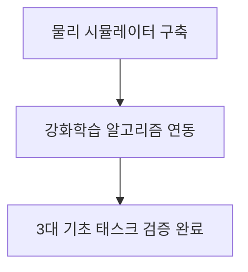
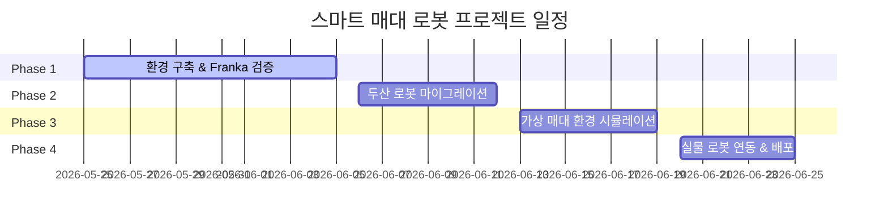
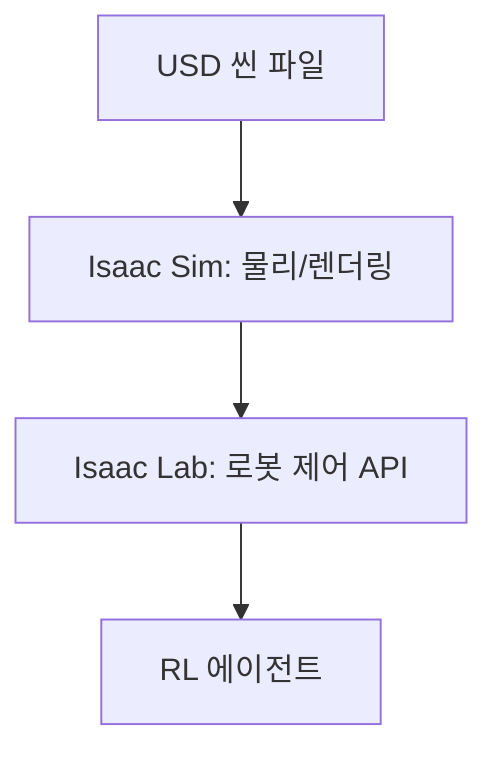
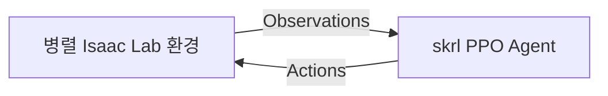
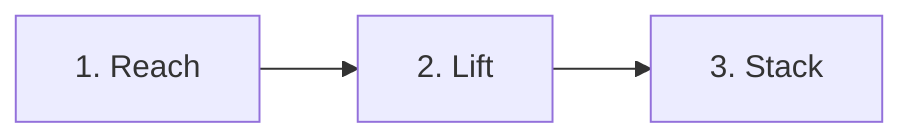
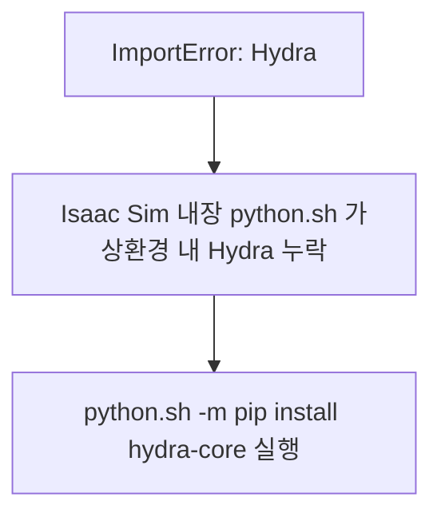
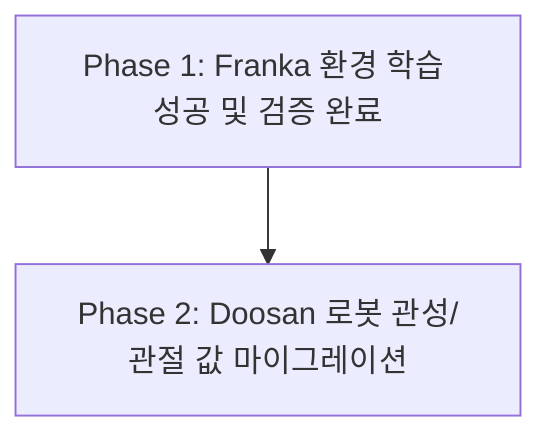

# Phase 1: 개발 환경 구축 및 강화학습 기초 태스크 검증

---

## Slide 1: 타이틀 (Title)
### Isaac Lab 기반 강화학습(RL) 환경 구축 및 기초 태스크 검증
- **주제**: Phase 1 개발 환경 설정 및 Franka 로봇 RL 검증
- **발표자**: 스마트 매대 로봇 AI 파트
- **목표**: Isaac Sim 및 Isaac Lab 기반 물리 시뮬레이션 환경을 구축하고 기초 조작 태스크(Reach, Lift, Stack)를 성공적으로 수렴시킵니다.



*Diagram Image Prompt*:
`Flat modern illustration of a robotic arm in a virtual simulator grasping a blue cube, clean UI dashboard overlay, vibrant tech blue and dark slate background, professional slide graphic.`

---

## Slide 2: 프로젝트 로드맵 (Roadmap)
### 전체 개발 주기에서 Phase 1의 위상
- **Phase 1 (완료)**: Franka 로봇 기본 RL 태스크 검증 (Reach, Lift, Stack) 및 시뮬레이션 의존성 해결
- **Phase 2**: Doosan E0509 로봇 환경 RL 마이그레이션 및 조인트 한계(Joint Limits) 보정
- **Phase 3**: 가상 매대(Shelf) 환경 시뮬레이션 및 장애물 회피 경로 계획 통합
- **Phase 4**: 실물 로봇 배포 및 하드웨어 정합 (ROS 2 인터페이스 연동)
- **Phase 5**: VLA(Vision-Language-Action) 모델 도입 및 실환경 배포



*Diagram Image Prompt*:
`A horizontal 5-step timeline flowchart showing progress from simulation to physical robot deployment, clean flat vector style, corporate blue and green colors.`

---

## Slide 3: 시스템 환경 스펙 (Environment Stack)
### 물리 연산과 시뮬레이션을 위한 하드웨어 및 소프트웨어 사양
- **OS**: Ubuntu 22.04 LTS
- **GPU**: NVIDIA RTX 5080 Laptop (16GB VRAM)
- **Driver**: NVIDIA 580.x 이상 (하드웨어 성능 극대화)
- **CUDA**: 호스트용 12.8 / Isaac Sim 내장용 13.0
- **PyTorch**: 2.7.0+cu128 (GPU 가속 텐서 연산 지원)

```mermaid
graph LR
    subgraph Host OS (Ubuntu 22.04)
        A[CUDA 12.8] --> B[PyTorch 2.7.0]
    end
    subgraph Simulator
        C[Isaac Sim 5.1.0] --> D[CUDA 13.0]
    end
```

*Diagram Image Prompt*:
`Infographic detailing computer specifications: CPU, GPU, CUDA logo, and PyTorch logo, technical blueprint style, transparent background.`

---

## Slide 4: 시뮬레이션 엔진 구성 (Simulation Core)
### Isaac Sim과 Isaac Lab의 통합 구조
- **Isaac Sim 5.1.0-rc.19**: Pixar USD 기반 고정밀 실시간 물리 렌더링 및 카메라 센서 모사
- **Isaac Lab 2.3.2**: 로봇 조작 학습을 최적화하기 위해 설계된 경량 벡터화 환경 래퍼
- **실습실 표준 환경**: 원격 가상화(Docker)의 드라이버 호환 한계를 극복하기 위해 물리 장치 성능을 직접 활용하는 로컬 네이티브 환경 채택



*Diagram Image Prompt*:
`An abstract diagram representing software layers: Isaac Sim on the bottom, Isaac Lab in the middle, and Reinforcement Learning on top, glowing lines, flat 3D perspective style.`

---

## Slide 5: 강화학습 및 PPO 아키텍처 (RL & PPO Setup)
### 대규모 병렬 수집과 고속 학습 최적화 설정
- **RL 라이브러리**: `skrl v2.x` (PyTorch 기반 Simple Reinforcement Learning)
- **알고리즘**: PPO (Proximal Policy Optimization) - 안정적인 정책 업데이트 보장
- **네트워크 구조**: MLP (Multi-Layer Perceptron) 레이어 구조 `[64, 64]`
- **병렬 환경**: 수십 개의 로봇 환경을 동시에 시뮬레이션하여 학습 데이터 획득 속도 향상



*Diagram Image Prompt*:
`Robotic hand taking action based on network decision, input data flows in and output joint values flow out, high-contrast dark blue background, flat vector illustration.`

---

## Slide 6: Phase 1 검증 태스크 (Franka RL Tasks)
### Doosan 로봇 마이그레이션의 기준점이 된 Franka 3대 기본 동작
- **Reach (도달)**: 로봇 플랜지 끝단을 공간 내 무작위 목표 좌표로 충돌 없이 신속하게 이동
- **Lift (물체 리프팅)**: 테이블 위 무작위 위치의 큐브 블록을 그리퍼로 안전하게 집어 위로 들어 올림
- **Stack (쌓기)**: 집어 올린 큐브 블록을 다른 타겟 블록 위에 정확하게 정렬하여 적층



*Diagram Image Prompt*:
`Three stages of robot action: first reaching a block, second picking the block up, third placing the block on another block, sequence layout, vector illustration.`

---

## Slide 7: 트러블슈팅 1 - Hydra 의존성 해결 (Hydra Error)
### 가상환경 패키지 누락 오류 디버깅
- **문제**: 학습 스크립트 실행 시 `ImportError: Hydra is not installed` 오류 발생하며 중단
- **원인**: Isaac Sim은 자체 내장된 파이썬 실행기(`python.sh`)를 사용하나, 해당 가상 환경에 `hydra-core` 패키지가 설치되지 않음
- **해결**: 내장 파이썬 환경에 명시적으로 의존성 패키지를 설치하여 빌드 환경 완성
  ```bash
  ~/smart-shelf-robot/third_party/IsaacLab/_isaac_sim/python.sh -m pip install hydra-core
  ```



*Diagram Image Prompt*:
`Debugging process illustration: puzzle piece labeled "Hydra" fits into a larger system block, light green highlight for success, flat tech style.`

---

## Slide 8: 트러블슈팅 2 - 입력 키 불일치 수정 (Input Key Mismatch)
### skrl v2.x 래퍼 구조 호환성 패치
- **문제**: 네트워크 초기화 단계에서 `NoneType object has no attribute shape` 오류로 학습 실패
- **원인**: 설정 파일(`skrl_ppo_cfg.yaml`)에 입력 데이터 키가 `STATES`로 선언되어 있으나, skrl v2.x 환경 래퍼는 비대칭 상태가 없을 때 일반 관측 데이터를 `"observations"` 키로 수령함
- **해결**: 설정 파일 내 모든 입력 정의를 `OBSERVATIONS`로 변경하여 데이터 흐름 정상화
  ```diff
  - input: STATES
  + input: OBSERVATIONS
  ```

```mermaid
graph LR
    States[STATES (None 전달)] --> Error[PyTorch shape 에러]
    Obs[OBSERVATIONS (정상 데이터)] --> Success[학습 네트워크 활성화]
```

*Diagram Image Prompt*:
`Configuration text comparison highlighting change from STATES to OBSERVATIONS, code editor style, flat layout.`

---

## Slide 9: 트러블슈팅 3 - play.py API 마이그레이션 (play.py API Fix)
### 평가(Play) 스크립트의 skrl v2.x API 정합
- **문제**: 학습 결과를 시각적으로 재생할 때 모듈 경로 누락 및 인자 개수 불일치 오류 발생
- **원인**: 기존 템플릿의 코드가 `skrl v1.x` 구조에 맞춰 작성되어 최신 `skrl v2.x` API와 호환되지 않음
- **해결**:
  1. 임포트 경로를 `isaaclab.utils`에서 `isaaclab_rl.utils`로 변경
  2. 에이전트 평가 모드 설정을 `enable_training_mode(False)`로 수정
  3. `act()` 함수 호출 시 상태 인자에 `None`을 명시적으로 전달
  ```python
  outputs = runner.agent.act(obs, None, timestep=0, timesteps=0)
  ```

*Diagram Image Prompt*:
`API migration concept: old code block linked with an arrow to updated python syntax block, visual transition diagram, vector art.`

---

## Slide 10: 결과 요약 및 향후 계획 (Conclusion & Next Steps)
### Phase 1 성과 요약 및 Phase 2 실행 계획
- **성과**: 
  - 학습 환경의 의존성 및 API 호환성 문제를 완벽히 디버깅
  - Franka Reach 환경 학습 시 약 **15 it/s** 속도로 학습이 원활히 수렴됨을 확인
  - 학습된 가중치(`best_agent.pt`)를 `play.py`를 통해 시각적으로 재생 검증 완료
- **향후 계획**: Doosan E0509 로봇 환경으로 RL 알고리즘 이식 및 조인트 물리 한계 정밀 보정



*Diagram Image Prompt*:
`Robotic arm completing a tasks list, checklist items marked with green checkmarks, final item glowing, professional clean slide graphic.`
