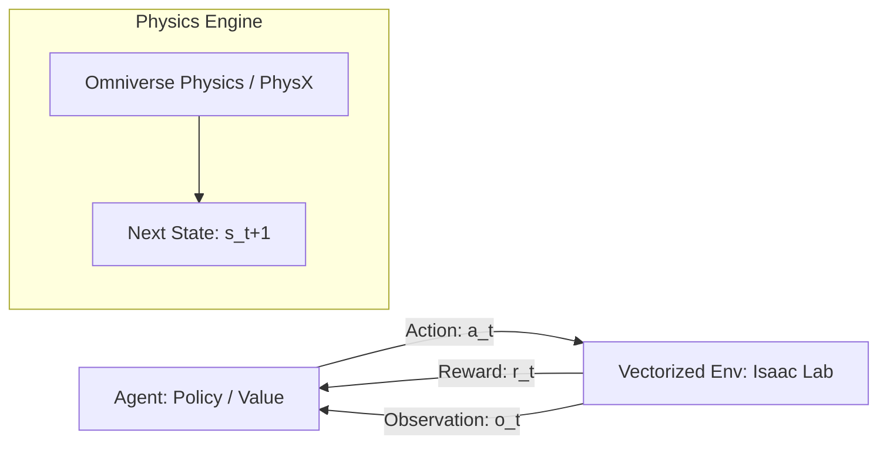
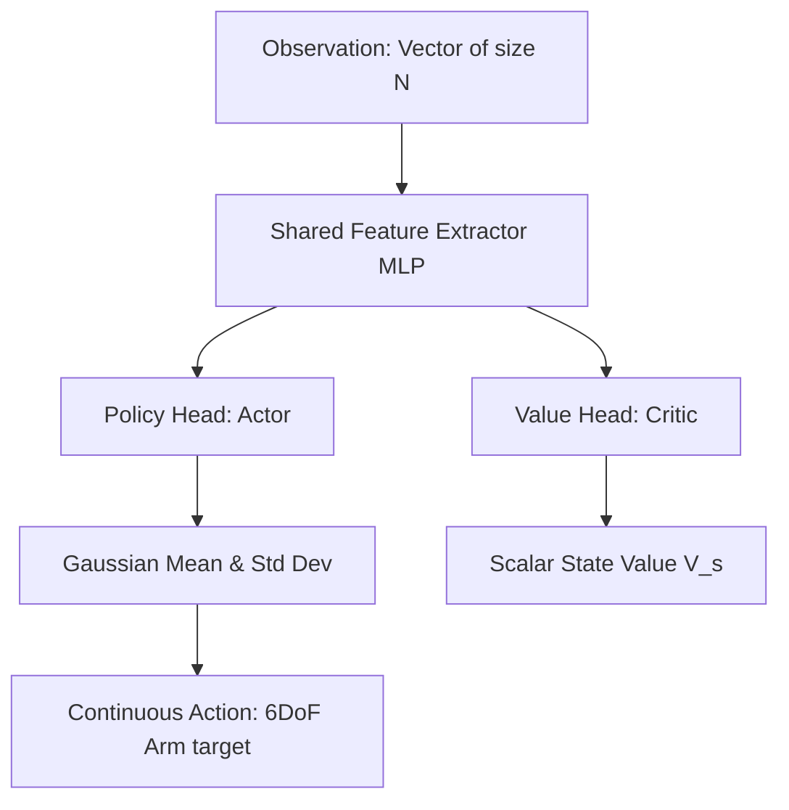

# Phase 1 Theory: Reinforcement Learning Fundamentals & PPO

This document details the mathematical, algorithmic, and systemic foundations of Phase 1, focusing on Markov Decision Processes (MDP), Proximal Policy Optimization (PPO), and Parallel Simulation.

---

## 1. Mathematical Formulation: Markov Decision Process (MDP)

Reinforcement learning in Isaac Lab is modeled as a Markov Decision Process (MDP) defined by the tuple:

$$\mathcal{M} = (\mathcal{S}, \mathcal{A}, \mathcal{P}, \mathcal{R}, \gamma)$$

Where:
- $\mathcal{S}$ represents the state space (or observation space $\mathcal{O}$ in partially observable settings).
- $\mathcal{A}$ represents the action space (continuous joint torque or position targets).
- $\mathcal{P}: \mathcal{S} \times \mathcal{A} \times \mathcal{S} \to [0, 1]$ represents the transition probability distribution: $P(s_{t+1} \mid s_t, a_t)$.
- $\mathcal{R}: \mathcal{S} \times \mathcal{A} \to \mathbb{R}$ represents the reward function $R(s_t, a_t)$.
- $\gamma \in [0, 1)$ is the discount factor for future rewards.

The objective of the agent (policy $\pi_\theta(a_t \mid s_t)$ parameterized by $\theta$) is to maximize the expected discounted return:

$$J(\theta) = \mathbb{E}_{\tau \sim \pi_\theta} \left[ \sum_{t=0}^{\infty} \gamma^t R(s_t, a_t) \right]$$

---

## 2. Core Optimization Algorithm: PPO (Proximal Policy Optimization)

PPO is a policy gradient method that optimizes a surrogate objective function. To prevent destructively large policy updates, PPO clips the policy probability ratio.

### 2.1 Probability Ratio
The policy ratio is defined as:

$$r_t(\theta) = \frac{\pi_\theta(a_t \mid s_t)}{\pi_{\theta_{old}}(a_t \mid s_t)}$$

### 2.2 Clipped Surrogate Objective
The objective function optimized by PPO is:

$$L^{CLIP}(\theta) = \hat{\mathbb{E}}_t \left[ \min\left(r_t(\theta)\hat{A}_t, \text{clip}(r_t(\theta), 1-\epsilon, 1+\epsilon)\hat{A}_t\right) \right]$$

Where:
- $\hat{A}_t$ is the estimated advantage at time $t$ (using Generalized Advantage Estimation, GAE).
- $\epsilon$ is the clipping hyperparameter (commonly set to $0.2$).

### 2.3 GAE Formulation
Generalized Advantage Estimation balance bias and variance via $\lambda$:

$$\hat{A}_t = \sum_{l=0}^{\infty} (\gamma \lambda)^l \delta_{t+l}^{V}$$
$$\delta_t^V = R_t + \gamma V_\phi(s_{t+1}) - V_\phi(s_t)$$

---

## 3. Structural Diagrams

### 3.1 MDP Interaction Loop


### 3.2 PPO Actor-Critic Network Architecture


---

## 4. Plotting Script: PPO Objective Visualization

Below is a Python script to plot the clipped surrogate objective of PPO based on the advantage value.

```python
import numpy as np
import matplotlib.pyplot as plt

def ppo_clipping_plot():
    r = np.linspace(0.5, 1.5, 500)
    epsilon = 0.2
    
    # Advantage > 0
    adv_pos = 1.0
    obj_unclipped_pos = r * adv_pos
    obj_clipped_pos = np.clip(r, 1 - epsilon, 1 + epsilon) * adv_pos
    obj_ppo_pos = np.minimum(obj_unclipped_pos, obj_clipped_pos)
    
    # Advantage < 0
    adv_neg = -1.0
    obj_unclipped_neg = r * adv_neg
    obj_clipped_neg = np.clip(r, 1 - epsilon, 1 + epsilon) * adv_neg
    obj_ppo_neg = np.minimum(obj_unclipped_neg, obj_clipped_neg)
    
    fig, ax = plt.subplots(1, 2, figsize=(12, 5))
    
    # Positive Advantage Plot
    ax[0].plot(r, obj_unclipped_pos, '--', label='Unclipped r*A', color='gray')
    ax[0].plot(r, obj_ppo_pos, '-', label='PPO Objective', color='blue', linewidth=2.5)
    ax[0].axvline(1.0, color='black', linestyle=':', alpha=0.5)
    ax[0].axvline(1 - epsilon, color='red', linestyle=':', label='1-eps')
    ax[0].axvline(1 + epsilon, color='green', linestyle=':', label='1+eps')
    ax[0].set_title("Positive Advantage ($A > 0$)")
    ax[0].set_xlabel("Ratio $r(\\theta)$")
    ax[0].set_ylabel("Surrogate Objective")
    ax[0].legend()
    ax[0].grid(True, alpha=0.3)
    
    # Negative Advantage Plot
    ax[1].plot(r, obj_unclipped_neg, '--', label='Unclipped r*A', color='gray')
    ax[1].plot(r, obj_ppo_neg, '-', label='PPO Objective', color='orange', linewidth=2.5)
    ax[1].axvline(1.0, color='black', linestyle=':', alpha=0.5)
    ax[1].axvline(1 - epsilon, color='red', linestyle=':')
    ax[1].axvline(1 + epsilon, color='green', linestyle=':')
    ax[1].set_title("Negative Advantage ($A < 0$)")
    ax[1].set_xlabel("Ratio $r(\\theta)$")
    ax[1].set_ylabel("Surrogate Objective")
    ax[1].legend()
    ax[1].grid(True, alpha=0.3)
    
    plt.tight_layout()
    plt.savefig("ppo_clipping_function.png")
    plt.show()

if __name__ == "__main__":
    ppo_clipping_plot()
```

*Image Generation Prompt for Graph*:
`Scientific line graph showing PPO clipping objective function curves, two subplots comparing positive and negative advantages, clean white background, high contrast colors suitable for presentation slide, clear axis labels.`
