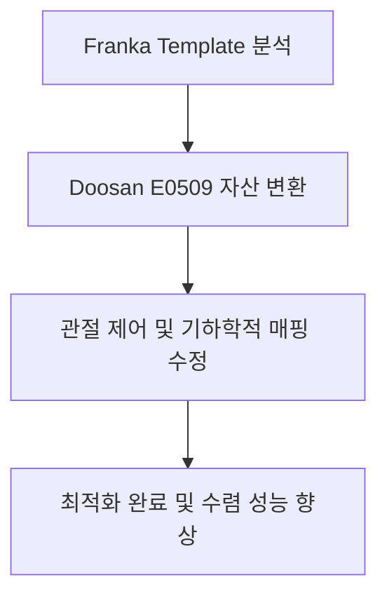
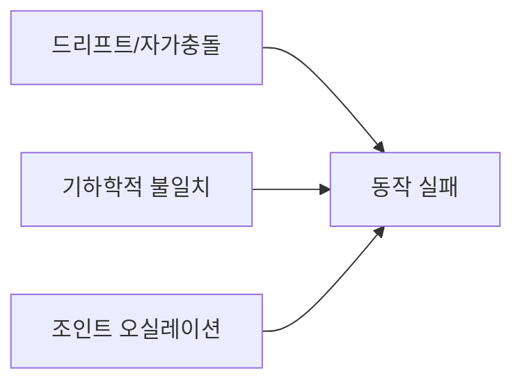
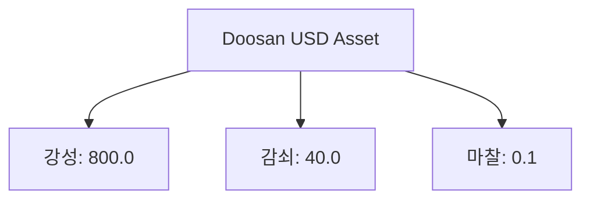
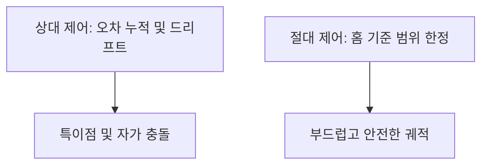

# Phase 2: Doosan E0509 로봇 강화학습 마이그레이션 및 최적화

---

## Slide 1: 타이틀 (Title)
### 두산 E0509 로봇의 Isaac Lab 강화학습 이식 및 성능 극대화
- **주제**: Franka baseline에서 두산 E0509 협동 로봇으로의 RL 환경 마이그레이션 성공
- **발표자**: 스마트 매대 로봇 AI 파트
- **목표**: 6축 두산 로봇의 물리적·기하학적 제약 조건을 해결하고 안정적인 조작 제어 정책을 획득합니다.



*Diagram Image Prompt*:
`Flat vector design of a yellow 6-axis Doosan robot arm rotating its joints, coordinate grid background, clean modern slide graphics, dark blue theme.`

---

## Slide 2: Phase 2 핵심 목표 및 도전 과제 (Core Objectives)
### Franka 에뮬레이션에서 6축 두산 로봇으로 전환 시 발생한 병목 현상
- **자원 격리**: 기존 `franka_isaaclab` 패키지와의 소프트링크 혼선을 제거하고, [smart-shelf-robot](file:///home/iyangim/smart-shelf-robot) 내에 자체 구동 환경 정비
- **관절 동작 불안정**: 상대 제어 적용 시 관절의 누적 드리프트 및 자가 충돌(Self-Collision) 발생
- **기하학적 불일치**: 홈 포즈와 타깃 엔드이펙터 오리엔테이션이 어긋나 손목이 비틀리는 특이점(Singularity) 현상 발견
- **강성 제어 문제**: 높은 강성에 비해 감쇠력이 부족해 조인트가 한계 영역에서 떨리는 오실레이션 제어 이슈 해결 필요



*Diagram Image Prompt*:
`Robotic arm schematic diagram with warning indicators on joints, highlighting physical limits and joint binding errors, minimalist technical design.`

---

## Slide 3: 두산 E0509 로봇 에셋 설정 (Asset Configuration)
### 물리 속성 튜닝을 통한 현실적인 거동 구현
- **설정 파일**: [doosan.py](file:///home/iyangim/smart-shelf-robot/src/custom/rl/doosan.py)
- **조인트 액추에이터 설정**: Implicit Actuator 기반 6축 조인트 독립 제어
  - **stiffness (강성)**: `800.0` (안정적인 관절 형태 유지)
  - **damping (감쇠)**: `40.0` (오버슈트 억제)
  - **friction (마찰 계수)**: `0.1` 반영 (고강성 제어 환경 내 미세 진동 완화)
- **조인트명 매핑**: `joint_1` ~ `joint_6`로 USD 에셋과 명시적 1:1 매핑 (정규식 예외 방지)



*Diagram Image Prompt*:
`3D CAD render outline of a robotic joint showing stiffness springs and damping dashpots, blue line art style, vector infographic.`

---

## Slide 4: 홈 자세 및 기하학적 일관성 최적화 (Home Pose & Geometry)
### 툴플랜지가 지면을 정방향으로 바라보도록 축 정렬
- **홈 포즈 수정**: `joint_3: 1.57 rad (90도)`, `joint_5: 1.57 rad (90도)` 설정
  - 하늘을 향해 일자로 서 있던 이전 자세에서 탈피하여 툴플랜지가 작업 매대(지면)를 자연스럽게 수직 방향으로 바라보도록 고안
- **방향성 목표 일치**: Pitch 제어 범위를 `(math.pi, math.pi)`로 묶어 로봇 손목의 무의미한 회전을 구속
- **보상 함수**: 방향성 추적 보상(Orientation Reward) 가중치를 `-0.1`로 복원하여 수직 정렬 하강 유도

```mermaid
graph LR
    Upright[기존: 수직 홈포즈 (학습 불가)] --> Tilted[개선: 굽힌 홈포즈 (매대 정렬)]
```

*Diagram Image Prompt*:
`Robotic arm transitioning from an upright pose to a bent, shelf-facing pose with angle indicators, flat vector illustration.`

---

## Slide 5: 절대 위치 제어로의 전환 (Absolute Position Control)
### 동작 영역 제한을 통한 관절 꼬임 및 오동작 제거
- **제어 방식 교체**: 누적 오차가 발생하는 상대 제어($\Delta q$)에서 **절대 위치 제어(`JointPositionActionCfg`)**로 원복
- **동작 범위 스케일링**: `scale=0.5` 및 `use_default_offset=True` 선언
- **기대 효과**: 인공지능이 출력하는 액션 명령이 홈 포즈 기준 항상 **$\pm 0.5\text{ rad}$ ($\pm 28.6^\circ$) 영역** 이내로 제한되어, 로봇 관절이 스스로 꼬이거나 충돌 범위를 벗어나는 불안정 동작 원천 제거



*Diagram Image Prompt*:
`Graph comparing random drift trajectory with a bounded, smooth trajectory, clean presentation style, vector graphic.`

---

## Slide 6: 강화학습 환경 설정 (RL Environment Config)
### Doosan Reach 환경 MDP(Markov Decision Process) 설계
- **설정 파일**: [doosan_joint_pos_env_cfg.py](file:///home/iyangim/smart-shelf-robot/src/custom/rl/envs/doosan_joint_pos_env_cfg.py)
- **관측 공간 (Observation Space)**:
  - 조인트 위치 및 속도 ($q, \dot{q}$)
  - 엔드이펙터 타깃 좌표와의 상대 거리 ($p_{\text{target}} - p_{\text{ee}}$)
- **행동 공간 (Action Space)**: 6차원 조인트 절대 목표 변위 ($q_{\text{target}}$)
- **보상 함수 (Reward Function)**:
  - 위치 거리 오차 보상 (최대 가중치 `1.0`)
  - 관절 급가속 패널티 (`joint_vel`, `-0.01`) 및 행동 안정화 패널티 (`action_rate`, `-0.01`)


*Diagram Image Prompt*:
`Flowchart of observation state vectors feeding into a policy neural network block resulting in joint position targets, clean tech layout.`

---

## Slide 7: PPO 에이전트 하이퍼파라미터 (Hyperparameters)
### skrl PPO 최적화 튜닝 설정
- **설정 파일**: [doosan_skrl_ppo_cfg.yaml](file:///home/iyangim/smart-shelf-robot/src/custom/rl/envs/doosan_skrl_ppo_cfg.yaml)
- **핵심 파라미터**:
  - **은닉층 구성**: [64, 64] MLP 구조
  - **학습률 (Learning Rate)**: `1.0e-03`
  - **미니배치 에폭 수 (Epochs)**: `5`
  - **할인 인자 (Discount Factor, $\gamma$)**: `0.99`
  - **로그 저장 폴더**: `reach_doosan_e0509`로 분류 저장하여 학습 지표 관리 일치화

*Diagram Image Prompt*:
`Network architecture diagram showing MLP layers, activation flows, and optimization logs output block, clean corporate styling.`

---

## Slide 8: 훈련 및 재생 실행 방법 (Execution Commands)
### smart-shelf-robot 내에서 수행하는 독립적 실행 프로세스
- **사전 정기구학(FK) 및 자세 검증**:
  ```bash
  ~/smart-shelf-robot/third_party/IsaacLab/_isaac_sim/python.sh src/custom/rl/scratch/check_fk.py
  ```
- **독립적인 PPO 학습 수행 (Train)**:
  ```bash
  ~/smart-shelf-robot/third_party/IsaacLab/_isaac_sim/python.sh scripts/skrl/train.py --task=Template-Doosan-Reach-v0 --headless
  ```
- **학습 모델 시각 검증 및 비디오 녹화 (Play)**:
  ```bash
  ~/smart-shelf-robot/third_party/IsaacLab/_isaac_sim/python.sh scripts/skrl/play.py \
      --task=Template-Doosan-Reach-Play-v0 \
      --checkpoint=logs/skrl/reach_doosan_e0509/<DATE_DIR>/checkpoints/best_agent.pt --video
  ```

*Diagram Image Prompt*:
`Code console layout displaying shell commands with success checkmarks, clean typography, dark theme.`

---

## Slide 9: 훈련 결과 분석 및 비교 (Results & Improvement)
### 제어 방식 및 기하학적 설계 조정에 따른 성능 대폭 개선
- **평균 보상값 비교 (Total Reward Mean)**:
  - **개선 전 (상대 제어 및 어긋난 자세)**: `0.5144`
  - **개선 후 (절대 제어 + 수직 정렬 홈포즈 + 마찰 보정)**: **`0.7654`** (**48.8% 향상**)
- **거동 양상**: 관절 꼬임 현상이 완전히 사라졌으며, 100스텝 동안 목표 타깃 지점까지 매우 부드럽고 일정한 궤적으로 신속하게 수동 도달하는 안정적 궤적 수렴 달성

```mermaid
xychart-beta
    title "평균 학습 보상값 비교"
    x-axis [개선 전, 개선 후]
    y-axis "보상 합계 (Reward)" 0 --> 1
    bar [0.5144, 0.7654]
```

*Diagram Image Prompt*:
`A comparative bar chart showing a 48% performance increase, green success color scheme, professional business slide layout.`

---

## Slide 10: 실로봇 배포 준비 (Sim-to-Real Deployment)
### 가상 학습 환경에서 실물 로봇으로의 정책 전파
- **ONNX 변환 완료**: PyTorch `.pt` 가중치를 [export_onnx.py](file:///home/iyangim/smart-shelf-robot/src/custom/rl/scratch/export_onnx.py)를 통해 `policy.onnx`로 경량화 변환
- **ROS 2 추론 노드 연동**: [policy_node.py](file:///home/iyangim/smart-shelf-robot/src/rl/policy_node.py)에서 `onnxruntime`을 이용하여 `/joint_states` 수신 및 `/policy/joint_targets` 발행
- **안전 제한 조치**: 실하드웨어에 주입 시 오작동 방지를 위한 변위 필터 및 하드웨어 가드라인 연동 완료


*Diagram Image Prompt*:
`A schematic representing virtual neural network connecting to a physical robot control box via ROS2 network interface, blue tech line art.`
