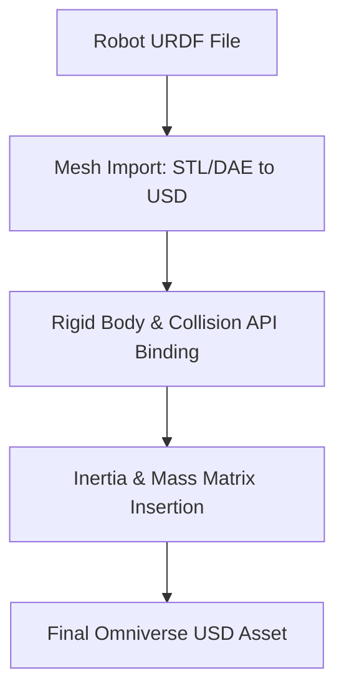

# Phase 2 Theory: Robot Articulation & Rigid Body Dynamics

This document details the kinematics, rigid body dynamics, and simulation asset translation pipelines (URDF to USD) critical for Phase 2.

---

## 1. Kinematics of Articulated Robots

An articulated manipulator is modeled as a kinematic chain of rigid links connected by joints (revolute or prismatic).

### 1.1 Forward Kinematics
The pose of the end-effector relative to the robot base is determined by a product of homogeneous transformation matrices:

$$T_n^0(q) = \prod_{i=1}^n A_i(q_i) = A_1(q_1) A_2(q_2) \dots A_n(q_n)$$

Where:
- $q = [q_1, q_2, \dots, q_n]^T$ is the vector of joint angles.
- $A_i(q_i)$ represents the transformation matrix from link $i$ to link $i-1$.

### 1.2 Differential Kinematics (Jacobian)
The relationship between joint velocities $\dot{q}$ and end-effector linear and angular velocities $v_e = [\dot{x}, \omega]^T$ is defined by the Geometric Jacobian matrix $J(q)$:

$$v_e = J(q) \dot{q}$$

Where $J(q) \in \mathbb{R}^{6 \times n}$ is computed as:

$$J(q) = \begin{bmatrix} J_P(q) \\ J_O(q) \end{bmatrix}$$

---

## 2. Rigid Body Dynamics (Euler-Lagrange Formulation)

The equations of motion of the robotic manipulator in joint space are derived via the Euler-Lagrange equations:

$$\frac{d}{dt} \left( \frac{\partial L}{\partial \dot{q}} \right) - \frac{\partial L}{\partial q} = \tau$$

This yields the fundamental dynamics equation:

$$M(q)\ddot{q} + C(q, \dot{q})\dot{q} + g(q) + J^T(q)f_e = \tau$$

Where:
- $M(q) \in \mathbb{R}^{n \times n}$ is the symmetric, positive-definite Joint Space Inertia Matrix.
- $C(q, \dot{q}) \in \mathbb{R}^{n \times n}$ represents Coriolis and centrifugal coefficients.
- $g(q) \in \mathbb{R}^n$ represents the gravity torque vector.
- $f_e$ is the external force/torque vector exerted on the environment by the end-effector.
- $\tau \in \mathbb{R}^n$ represents the applied joint torques.

---

## 3. Structural Diagrams

### 3.1 Kinematic Transformation Chain
```mermaid
graph LR
    Base[Base Frame: {0}] -- A_1(q_1) --> Joint1[Joint 1: {1}]
    Joint1 -- A_2(q_2) --> Joint2[Joint 2: {2}]
    Joint2 -- ... --> JointN[Joint N: {n}]
    JointN -- T_tool --> Flange[End Effector Flange: {e}]
```

### 3.2 URDF to USD Conversion Pipeline


---

## 4. Plotting Script: Joint Space Trajectory Plot

Below is a Python script to plot joint position trajectories ($q$) and joint velocities ($\dot{q}$) over time.

```python
import numpy as np
import matplotlib.pyplot as plt

def joint_trajectory_plot():
    t = np.linspace(0, 5, 200)
    
    # Simulate trajectories for a 3-DOF subsystem
    q1 = np.sin(t) * 0.5 + 0.1 * t
    q2 = np.cos(1.5 * t) * 0.4
    q3 = np.sin(2.0 * t) * 0.3 - 0.2
    
    dq1 = np.gradient(q1, t)
    dq2 = np.gradient(q2, t)
    dq3 = np.gradient(q3, t)
    
    fig, ax = plt.subplots(2, 1, figsize=(10, 8), sharex=True)
    
    # Joint Positions
    ax[0].plot(t, q1, label='Joint 1', color='darkblue')
    ax[0].plot(t, q2, label='Joint 2', color='darkgreen')
    ax[0].plot(t, q3, label='Joint 3', color='darkred')
    ax[0].set_ylabel("Position (rad)")
    ax[0].set_title("Joint Positions over Time")
    ax[0].legend()
    ax[0].grid(True, alpha=0.3)
    
    # Joint Velocities
    ax[1].plot(t, dq1, '--', label='Joint 1 Vel', color='blue')
    ax[1].plot(t, dq2, '--', label='Joint 2 Vel', color='green')
    ax[1].plot(t, dq3, '--', label='Joint 3 Vel', color='red')
    ax[1].set_xlabel("Time (s)")
    ax[1].set_ylabel("Velocity (rad/s)")
    ax[1].set_title("Joint Velocities over Time")
    ax[1].legend()
    ax[1].grid(True, alpha=0.3)
    
    plt.tight_layout()
    plt.savefig("joint_space_trajectories.png")
    plt.show()

if __name__ == "__main__":
    joint_trajectory_plot()
```

*Image Generation Prompt for Graph*:
`Line chart showing robotic manipulator joint space trajectory curves, tracking position and velocity over a 5 second execution time window, dark color theme suitable for technical reports, clean vector style.`
