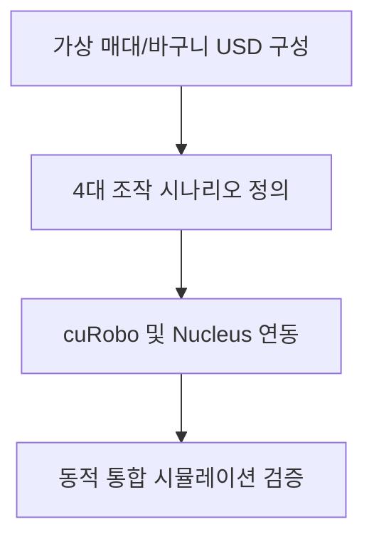
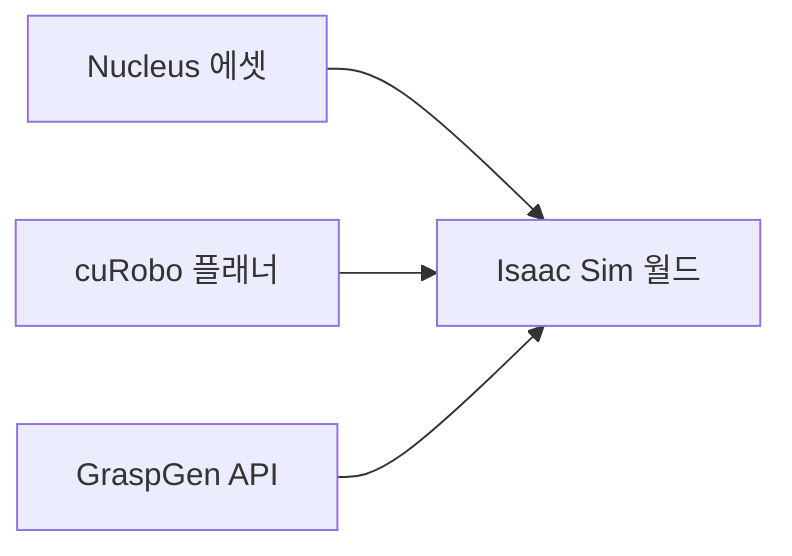
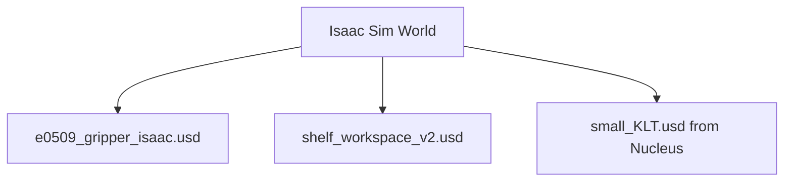
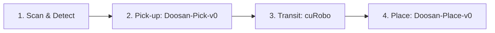
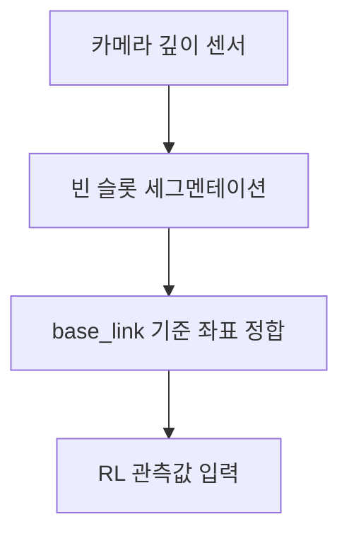
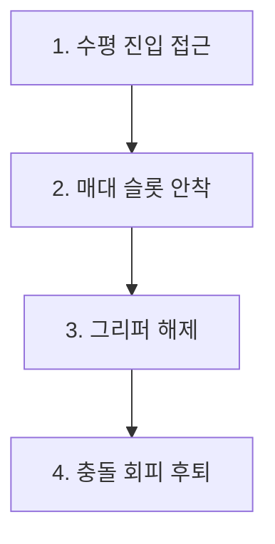
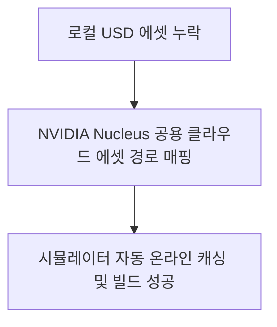
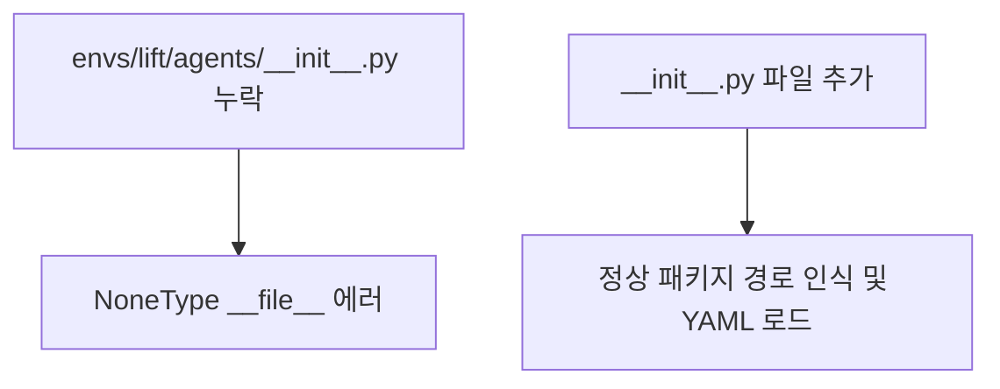
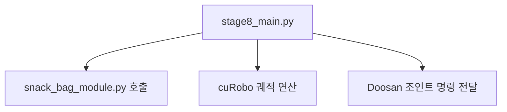
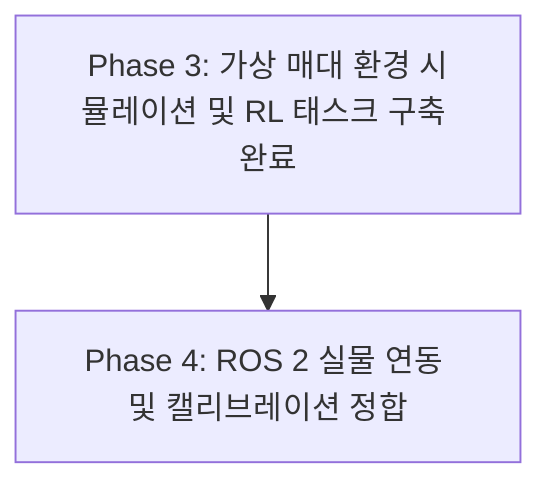

# Phase 3: 가상 매대 시뮬레이션 통합 및 강화학습 설정

---

## Slide 1: 타이틀 (Title)
### 가상 매대(Shelf) 환경 시뮬레이션 통합 및 RL 태스크 설정
- **주제**: 가상 편의점 매대 및 바스켓 환경 USD 모델 통합과 조작 시나리오 훈련 환경 구축
- **발표자**: 스마트 매대 로봇 AI 파트
- **목표**: 복잡한 물품 스캔, 집기, 이동, 배치 시나리오를 물리 가상 환경 내에서 단계별로 정합하고 최신 에셋 연동 오류를 해결합니다.



*Diagram Image Prompt*:
`Flat vector design of a yellow 6-axis Doosan robot arm transferring a snack bag onto a multi-tier convenience store shelf, dark slate theme with cyan neon accents, professional presentation style.`

---

## Slide 2: Phase 3 통합 개요 (Phase 3 Objectives)
### 가상 매대 시뮬레이션 통합의 목적과 핵심 구성 요소
- **동적 공간 연동**: 매대 공간과 물품 보관 바스켓을 배치하여 실물 환경과 정합하는 디지털 트윈 기초 인프라 조성
- **핵심 기술 연계**: 
  - NVIDIA Nucleus 서버를 통한 가용 표준 에셋 실시간 로딩
  - cuRobo 가속 경로 기획기(Path Planner)와 조인트 관절 궤적 추종 RL 정책 병합
  - ZMQ 소켓 통신을 이용한 GraspGen(파지 생성기) 클라이언트-서버 연동



*Diagram Image Prompt*:
`Robotics framework infographic with interconnected blocks showing: Cloud Asset Database, Physics Engine, Motion Planner, and Agent Policy, clean tech vector graphic.`

---

## Slide 3: 가상 매대 USD 자산 구성 (USD Assets)
### 물리 세계 모사를 위한 USD 월드 에셋 배치
- **핵심 에셋 파일**:
  - [shelf_workspace_v2.usd](file:///home/iyangim/smart-shelf-robot/src/custom/rl/assets/shelf_workspace_v2.usd) (매대 조작 환경 월드)
  - [e0509_gripper_isaac.usd](file:///home/iyangim/smart-shelf-robot/src/custom/rl/assets/e0509_gripper_isaac.usd) (그리퍼가 장착된 두산 로봇 모델)
- **외부 서버 에셋 연동**:
  - `small_KLT.usd` (NVIDIA Nucleus 표준 바스켓 모델)
  - `sektion_cabinet_instanceable.usd` (NVIDIA Nucleus 표준 가판대 캐비닛 모델)



*Diagram Image Prompt*:
`A wireframe model of a cabinet and retail shelf next to a robot arm with transparent polygons, technical blue draft style.`

---

## Slide 4: 스마트 매대 조작 4대 태스크 (Group 2 Tasks)
### 가상 매대 시나리오 완수를 위한 단계별 작업 정의
- **Task 1: 스캔 & 탐색 (Scan & Detect)**: 카메라 피드로부터 적재물 정보 및 매대 빈 공간 위치 파악
- **Task 2: 바스켓 집기 (Pick-up)** (`Doosan-Pick-v0`): 바구니 내부의 상품을 정밀 파지하여 들어올리는 제어
- **Task 3: 장애물 회피 이송 (Transit)**: 매대 기둥 및 주변 물품과의 충돌을 회피하는 최적 경로 이동
- **Task 4: 매대 수납 (Place)** (`Doosan-Place-v0`): 매대 슬롯 내부 빈 공간에 정렬하여 정밀 진열



*Diagram Image Prompt*:
`A sequence flowchart showing a four-step retail robot automation workflow: 1. scan box, 2. lift box, 3. steer around poles, 4. insert into rack, flat design.`

---

## Slide 5: Task 1 - 스캔 및 탐색 (Scan & Detect)
### RGB-D 카메라 기반의 정밀 3D 타깃 획득
- **동적 좌표 추출**: 시뮬레이터 내부 RGB-D 카메라의 이미지 세그멘테이션 정보 획득
- **3D 바운딩 박스 변환**:
  - 카메라 로컬 좌표계 기준의 탐색 결과를 로봇의 기준 프레임(`base_link`) 좌표계로 투영
  - 빈 진열장 영역 분할(Segmentation) 및 물체 포즈 `[x, y, z, q_w, q_x, q_y, q_z]` 계산
- **역할**: 강화학습 에이전트의 관측값(Observation) 레이어에 동적으로 목표 위치 주입



*Diagram Image Prompt*:
`A camera projecting a green laser outline grid onto shelves, identifying empty slot coordinates, tech scanner concept vector.`

---

## Slide 6: Task 2 - 바스켓 내 물품 집기 (Doosan-Pick-v0)
### 협소한 공간에서의 간섭 회피 파지 학습
- **환경 구성**: 바스켓 벽면 및 인접 상품 구조로 인해 조작 반경이 매우 좁은 경계 조건
- **관측 정보**: 그리퍼 팁 위치, 대상 물체의 3D 위치 및 오리엔테이션, 그리퍼 조인트 개폐 각도
- **보상 함수 설계**:
  - 그리퍼 팁과 대상체 근접 보상 (기본 가중치)
  - 실제 파지 성공(Grasp Event) 시 리프팅 보상 활성화 및 바스켓 충돌 패널티 강화
- **학습 결과**: 좁은 벽면 모서리에 근접한 사물도 충돌을 최소화하며 접근하도록 학습 수렴

*Diagram Image Prompt*:
`Robotic fingers gently clasping a box inside a plastic storage bin, zoom-in technical illustration, smooth flat graphics.`

---

## Slide 7: Task 3 - 장애물 회피 이송 (Transit)
### cuRobo 가속 연산을 통한 고속 무충돌 경로 생성
- **통합 배경**: 강화학습 모델이 모든 원거리 이송 궤적을 학습하는 비효율성을 극복하기 위해 결정론적 모션 플래너 연계
- **cuRobo 결합**: NVIDIA CUDA 가속 기반 충돌 회피 알고리즘(cuRobo) 사용
  - 6축 관절각 상태를 기준으로 매대 기둥, 보관 바구니 경계면 등의 충돌체를 실시간 우회
  - 2.5D 포인트클라우드 장애물과 로봇 메시 간의 실시간 거리 연산 수행 후 궤적 발행


*Diagram Image Prompt*:
`Robotic arm path planning trajectory visualized as a glowing blue line weaving through red obstacle areas, clean vector visualization.`

---

## Slide 8: Task 4 - 매대 정밀 진열 (Doosan-Place-v0)
### 매대 선반 빈 슬롯 내 수납 및 정합 제어
- **환경 특징**: 매대 기둥 및 상단 선반으로 인해 수직 하강 진입이 불가능하며, 수평 방향 진입 궤적 필수 요구
- **학습 핵심 설정**:
  - 목표 슬롯 중심 좌표 도달 시 대폭 보상 부여
  - 수평 진입 자세 각도 유지를 위한 오리엔테이션 제어 패널티 적용
  - 물품이 매대 바닥에 도달한 후 그리퍼가 물품을 놓고 안전하게 탈출(Exit)하는 안정적인 시퀀스 정합



*Diagram Image Prompt*:
`Robotic hand placing a product into a narrow shelf slot, arrows indicating linear entrance and retreat paths, flat layout.`

---

## Slide 9: 트러블슈팅 1 - USD 자산 누락 에러 해결 (USD Fix)
### 로컬 누락 자산을 NVIDIA Nucleus 표준 에셋으로 대체
- **문제**: 가상 환경 초기화 중 `basket.usd` 및 `convenience_shelf.usd` 파일 경로를 찾지 못해 빌드 크래시 발생
- **원인**: 팀 내 공유 과정에서 로컬 저장소와 시뮬레이션 환경에 해당 커스텀 USD 에셋 누락
- **해결**: NVIDIA Omniverse Nucleus 공식 서버의 표준 호환 자산 경로로 설정을 우회하여 실시간으로 다운로드 및 연동되도록 조치
  - **바스켓**: `small_KLT.usd` (NVIDIA Nucleus 자산) 매핑
  - **매대 선반**: `sektion_cabinet_instanceable.usd` (NVIDIA Nucleus 자산) 매핑



*Diagram Image Prompt*:
`Cloud downloading symbol transferring an asset file to a simulator viewport window, computer graphics technical concept.`

---

## Slide 10: 트러블슈팅 2 - 키네마틱스 프레임 에러 수정 (Frame Error)
### 존재하지 않는 link_0 참조 오류 디버깅
- **문제**: `Doosan-Pick` 환경 기동 시 `ValueError: Not all regular expressions are matched!` 발생
- **원인**: Franka 로봇 설정 코드에서 상속하는 과정에서 두산 E0509 모델의 베이스 기준 프레임명을 존재하지 않는 `link_0`으로 참조
- **해결**: 
  - [doosan_pick_env_cfg.py](file:///home/iyangim/smart-shelf-robot/src/custom/rl/envs/pick/doosan_pick_env_cfg.py) 및 [doosan_place_env_cfg.py](file:///home/iyangim/smart-shelf-robot/src/custom/rl/envs/place/doosan_place_env_cfg.py) 내 변환기(Frame Transformer) 베이스 프레임 매핑 타깃 수정
  - `link_0` ➔ 두산 로봇의 올바른 기준 조인트명인 **`base_link`**로 정정하여 에러 해결

```diff
- target_frame="link_0"
+ target_frame="base_link"
```

*Diagram Image Prompt*:
`A joint schematic highlighting the correction of base_link frame, engineering diagram style, green success highlights.`

---

## Slide 11: 트러블슈팅 3 - Gym 환경 패키지 경로 정합 (Package Path Fix)
### 에이전트 YAML 로더 NoneType 에러 디버깅
- **문제**: `Doosan-Lift` 태스크 등록 및 훈련 스크립트 실행 시 `AttributeError: 'NoneType' object has no attribute '__file__'` 에러로 비정상 종료
- **원인**: 환경 등록기(`gym.register`)가 에이전트 설정 파일 경로를 불러올 때, `envs/lift/agents/` 디렉토리가 파이썬 모듈 패키지로 인식되지 않아 경로 탐색기에서 `None`을 반환
- **해결**: 
  - 해당 디렉토리에 빈 [\_\_init\_\_.py](file:///home/iyangim/smart-shelf-robot/src/custom/rl/envs/lift/agents/__init__.py) 파일을 생성하여 파이썬 패키지 트리로 정합화
  - 종료 조건 내 `mdp.object_dropped`에 전달할 매개변수가 `asset_cfg`로 오기입되어 있던 점을 설정에 맞게 `object_cfg`로 수정



*Diagram Image Prompt*:
`Python project tree diagram with a highlighted __init__.py file inside an agents subdirectory, minimalist code structure.`

---

## Slide 12: 트러블슈팅 4 - 하드코딩 경로 자동 리팩토링 (Path Refactoring)
### 사용자 환경 변화에 유연하게 대응하는 설정 파일 최적화
- **문제**: 전달받은 최신 가상환경 제어 스크립트가 이전 개발 서버 경로인 `"/home/devuser/..."`로 하드코딩되어 구동 실패
- **해결**: [stage8_main.py](file:///home/iyangim/smart-shelf-robot/src/custom/rl/rescent_env/stage8_main.py) 및 [snack_bag_module.py](file:///home/iyangim/smart-shelf-robot/src/custom/rl/rescent_env/snack_bag_module.py)의 시스템 의존 경로들을 현재 사용자 경로(`"iyangim"`) 기준으로 일괄 자동 리팩토링 수행

| 설정 대상 변수 | 변경 전 하드코딩 경로 | 변경 후 워크스페이스 정합 경로 |
| :--- | :--- | :--- |
| **cuRobo 설정 디렉터리 (`ROBOT_DIR`)** | `/home/devuser/...` | `/home/iyangim/smart-shelf-robot/src/external/e0509_gripper_description/config/curobo` |
| **로봇 USD 에셋 (`ROBOT_USD`)** | `/home/devuser/...` | `/home/iyangim/smart-shelf-robot/src/custom/rl/assets/e0509_gripper_isaac.usd` |
| **매대 월드 USD 에셋 (`V2_USD`)** | `/home/devuser/...` | `/home/iyangim/smart-shelf-robot/src/custom/rl/assets/shelf_workspace_v2.usd` |

*Diagram Image Prompt*:
`Refactoring process visual: paths in script text block redirecting from devuser home folder to iyangim workspace, vector illustration.`

---

## Slide 13: 가상 매대 시나리오 통합 스크립트 구동 (Integrated Script)
### stage8_main.py를 통한 종합 제어 아키텍처
- **메인 시나리오 컨트롤러**: [stage8_main.py](file:///home/iyangim/smart-shelf-robot/src/custom/rl/rescent_env/stage8_main.py)
  - 가상 매대 월드 구축 및 스캔 카메라 활성화
  - 과자 봉지 패키지(Snack Bag) 및 바구니 에셋 로딩
  - cuRobo 모션 플래너를 통한 다점 궤적 생성 및 조인트 가이드 연계
- **에셋 로더 모듈**: [snack_bag_module.py](file:///home/iyangim/smart-shelf-robot/src/custom/rl/rescent_env/snack_bag_module.py)
  - 과자 봉지의 물성(Mass, Friction, Collision)을 시뮬레이터 상에 정밀 주입



*Diagram Image Prompt*:
`Software block architecture diagram showing Main Script importing Snack Bag Module and communicating with Physics Solver, developer presentation vector.`

---

## Slide 14: 가상 매대 학습 실행 및 검증 (Training & Verification)
### smart-shelf-robot 프로젝트 내 독립적 10-Iteration 훈련 검증
- **검증 목적**: 환경 등록 및 연동 에러가 디버깅된 최신 RL 태스크 파일들이 실제로 오류 없이 학습 반복을 수행하는지 검증
- **수행 명령어**:
  ```bash
  # Doosan Pick Task 검증 학습
  third_party/IsaacLab/_isaac_sim/python.sh scripts/skrl/train.py --task Doosan-Pick-v0 --headless --max_iterations 10

  # Doosan Place Task 검증 학습
  third_party/IsaacLab/_isaac_sim/python.sh scripts/skrl/train.py --task Doosan-Place-v0 --headless --max_iterations 10
  ```
- **결과**: `gym` 환경 로딩 실패 없이 환경 정상 빌드 및 10스텝 학습 텐서 연산의 이상 없음 확인

*Diagram Image Prompt*:
`Two terminal screens side-by-side displaying training iterations progressing from 1 to 10 for Doosan-Pick and Doosan-Place tasks respectively, clean graphic.`

---

## Slide 15: 요약 및 향후 배포 계획 (Conclusion & Next Steps)
### Phase 3 성과 정리 및 Sim-to-Real 실물 연동 계획
- **성과**: 
  - Nucleus 공용 자원을 매개로 삼아 누적되었던 가상 매대 및 바스켓 USD 에셋의 경로 오류 전면 디버깅 완료
  - 로봇 기준 프레임명 매핑 수정(`base_link`) 및 패키지 `__init__.py` 누락 해결로 전체 RL 코드의 정상 컴파일 확보
  - `Doosan-Pick-v0` 및 `Doosan-Place-v0` 테스트 학습 구동 확인 완료
- **향후 계획 (Phase 4)**: 
  - 학습된 가중치 ONNX 변환 및 ROS 2 Humble 브릿지를 이용하여 실물 로봇 E0509와 연동 제어 테스트 착수



*Diagram Image Prompt*:
`Robotic hand receiving a physical box from a virtual space, representing digital-to-real migration, clean corporate final slide vector.`
