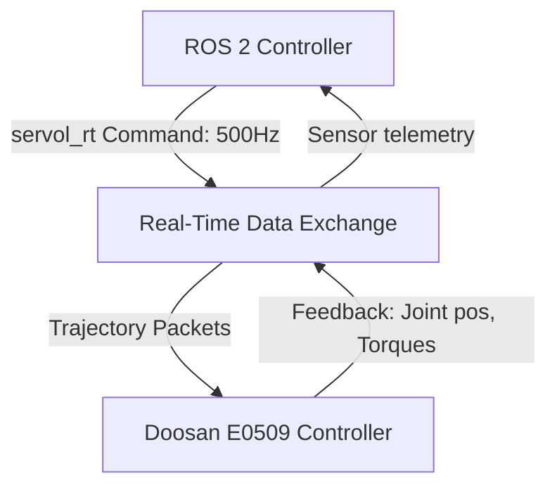

# Phase 3 Theory: Real Robot Control & Safety Guarding

This document outlines the mathematical models for control, safety validation, and communication interfaces required to bridge simulation and physical robot hardware.

---

## 1. Control Interface: Operational Space Impedance Control

To operate safely in contact-heavy tasks, robots use operational space impedance control. This models the end-effector as a virtual mass-spring-damper system connected to a target pose $x_{des}$.

### 1.1 Impedance Relationship
The target dynamic behavior is:

$$M_d (\ddot{x} - \ddot{x}_{des}) + D_d (\dot{x} - \dot{x}_{des}) + K_d (x - x_{des}) = f_{ext}$$

Where:
- $M_d, D_d, K_d$ represent the desired virtual mass, damping, and stiffness matrices respectively.
- $x, x_{des} \in \mathbb{R}^6$ are the actual and desired Cartesian poses.
- $f_{ext} \in \mathbb{R}^6$ represents the external force vector.

### 1.2 Homogeneous Joint Torque Mapping
To achieve this behavior, the joint command torque $\tau_{cmd}$ is computed via the Jacobian transpose:

$$\tau_{cmd} = J^T(q) \left[ K_p(x_{des} - x) + K_d(\dot{x}_{des} - \dot{x}) \right] + g(q) + C(q, \dot{q})\dot{q}$$

Where $g(q)$ and $C(q, \dot{q})\dot{q}$ act as feedforward compensation terms.

---

## 2. Safety Guards: Threshold & Collision Monitoring

To prevent physical damage, joint limits and torque outputs are verified inside a real-time monitor loop running at 500 Hz (2ms).

### 2.1 Torque Boundary Check
An emergency stop is triggered if the calculated joint torque exceeds safe thresholds:

$$\exists i \in [1, n] \quad \text{s.t.} \quad |\tau_i| > \tau_{i, limit}$$

### 2.2 Velocity/Position Boundary Check
Joint constraints are enforced via barrier potentials:

$$q_{i, min} + \delta \le q_i(t) \le q_{i, max} - \delta$$

Where $\delta$ represents the deceleration margin.

---

## 3. Structural Diagrams

### 3.1 Real-Time RTDE Control Loop


### 3.2 Emergency Safety Guard Logic
```mermaid
flowchart TD
    Start[Read Joint Sensors] --> CheckT[Check Torques: |tau_i| > Limit]
    CheckT -- Yes --> Stop[Trigger EMERGENCY STOP]
    CheckT -- No --> CheckP[Check Positions: q_i near Limits]
    CheckP -- Yes --> Decel[Apply Braking / Joint Deceleration]
    CheckP -- No --> Command[Send Command to Joint Actuators]
```

---

## 4. Plotting Script: Operational Space Step Response

Below is a Python script to simulate and plot the step response of an impedance controller under different damping ratios.

```python
import numpy as np
import matplotlib.pyplot as plt

def step_response_plot():
    t = np.linspace(0, 2.0, 500)
    target = 1.0
    
    # Underdamped
    omega_n = 10.0
    zeta_under = 0.3
    wd = omega_n * np.sqrt(1 - zeta_under**2)
    val_under = target * (1 - (np.exp(-zeta_under * omega_n * t) * 
                  (np.cos(wd * t) + (zeta_under * omega_n / wd) * np.sin(wd * t))))
    
    # Critically damped
    zeta_critical = 1.0
    val_critical = target * (1 - np.exp(-omega_n * t) * (1 + omega_n * t))
    
    # Overdamped
    zeta_over = 1.5
    s1 = -omega_n * (zeta_over - np.sqrt(zeta_over**2 - 1))
    s2 = -omega_n * (zeta_over + np.sqrt(zeta_over**2 - 1))
    c1 = s2 / (s2 - s1)
    c2 = -s1 / (s2 - s1)
    val_over = target * (1 - (c1 * np.exp(s1 * t) + c2 * np.exp(s2 * t)))
    
    plt.figure(figsize=(10, 6))
    plt.plot(t, val_under, label='Underdamped ($\zeta = 0.3$)', color='red')
    plt.plot(t, val_critical, label='Critically Damped ($\zeta = 1.0$)', color='green', linewidth=2.5)
    plt.plot(t, val_over, label='Overdamped ($\zeta = 1.5$)', color='blue')
    plt.axhline(target, color='black', linestyle='--', label='Target $x_{des}$')
    plt.title("Operational Space Impedance Controller Step Response")
    plt.xlabel("Time (s)")
    plt.ylabel("Position Error / Response")
    plt.legend()
    plt.grid(True, alpha=0.3)
    plt.savefig("impedance_step_response.png")
    plt.show()

if __name__ == "__main__":
    step_response_plot()
```

*Image Generation Prompt for Graph*:
`Technical engineering graph showing mechanical step response curves comparing underdamped, critically damped, and overdamped conditions, white grid background, clean layout suitable for PowerPoint presentations.`
