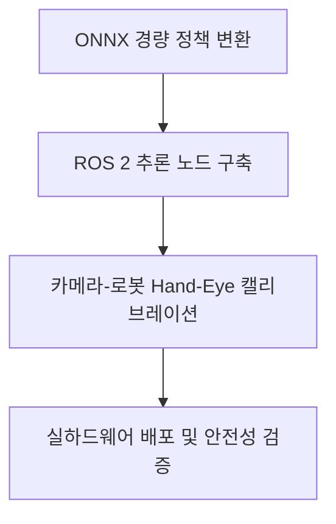
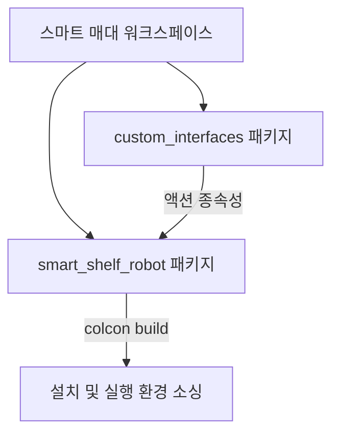
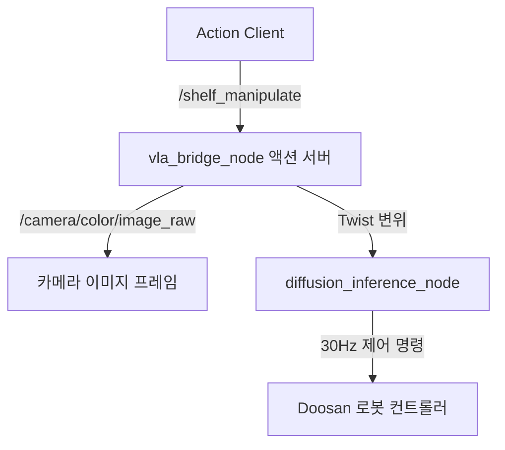
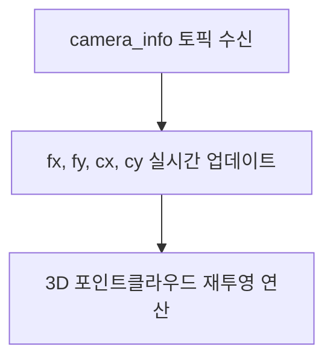
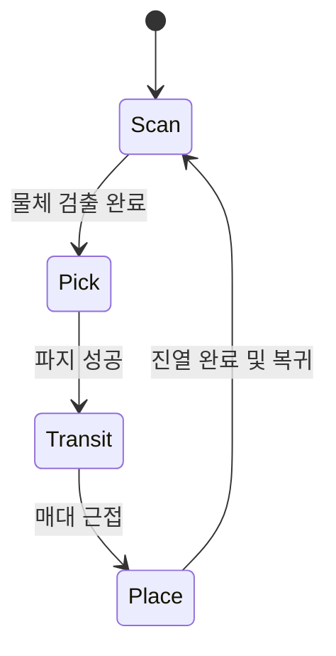
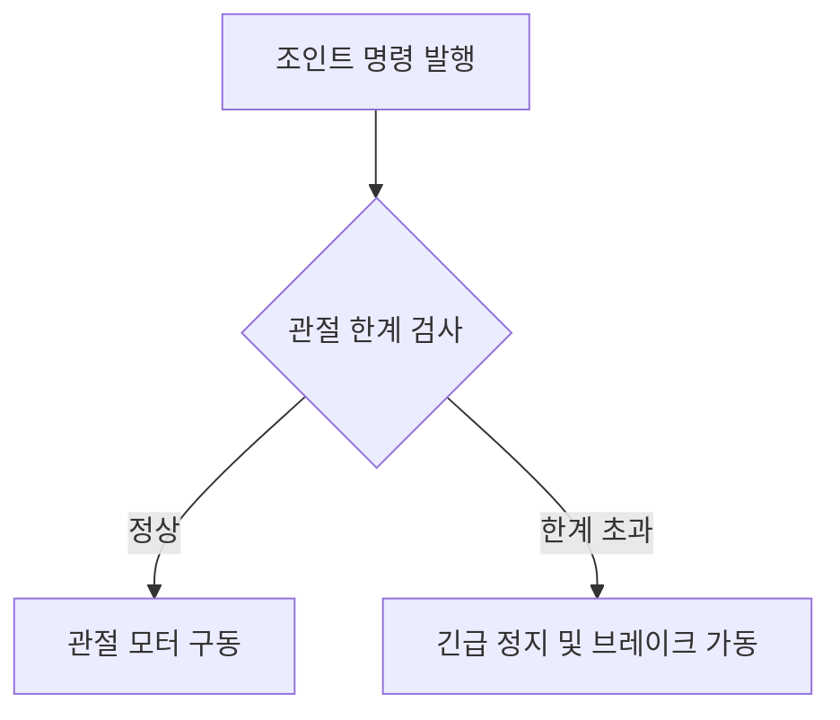
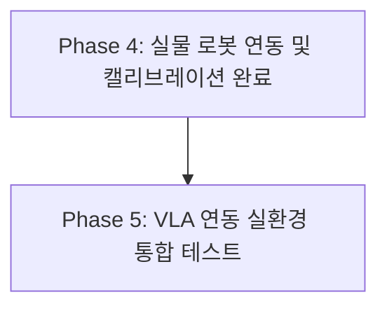

# Phase 4: 실물 로봇 배포 및 하드웨어 정합

---

## Slide 1: 타이틀 (Title)
### 두산 E0509 실물 로봇 배포 및 하드웨어 정합 (Sim-to-Real)
- **주제**: 가상 시뮬레이션에서 검증된 강화학습 정책의 실하드웨어 이식 및 센서 정합
- **발표자**: 스마트 매대 로봇 AI/제어 파트
- **목표**: 실물 Doosan E0509 로봇과 RH-P12-RN-A 그리퍼, RealSense 카메라 환경을 ROS 2 Humble 기반으로 통합하고 공간 좌표계를 정밀하게 정합합니다.

*Diagram Image Prompt*:
`Flat vector illustration of a real physical yellow robot arm connected to a Linux controller computer running ROS 2 Humble nodes, dark theme with glowing green connection paths.`

---

## Slide 2: Phase 4 배포 아키텍처 (Deployment Architecture)
### 가상 시뮬레이션(Sim)에서 실물 환경(Real)으로의 데이터 흐름
- **제어 루프 차단 해제**: 시뮬레이션 환경 wrapper에서 입증된 관절 제어 연산을 실하드웨어 제어 프레임워크로 이식
- **주요 통합 구성**:
  - **ONNX 추론 엔진**: PyTorch 가중치를 ONNX로 변환하여 온디바이스에서 초고속 추론 수행
  - **ROS 2 Humble**: 비전 감지, 로봇 상태 발행, 캘리브레이션 연산 간의 비동기 분산 통신
  - **안전 가드 노드**: 실물 기기 파손을 원천 차단하기 위한 하드웨어 경계 보호 로직

*Diagram Image Prompt*:
`A technical block diagram detailing: ONNX Policy File -> ROS2 Inference Node -> Robot Controller Hardware -> Motor Actuators, clean corporate vector style.`

---

## Slide 3: ROS 2 패키지 및 빌드 환경 (ROS 2 Workspaces)
### colcon 빌드 체계 및 의존성 정합
- **커스텀 ROS 2 패키지**:
  - `custom_interfaces`: `ShelfManipulate` 액션 등의 ROS 2 인터페이스 빌드
  - `smart_shelf_robot`: VLA-Diffusion 제어 브릿지 및 실시간 추론 연동 노드 탑재
- **의존성 다운그레이드**: ROS 2 Humble 빌드 템플릿과의 호환성을 고려하여 `empy` 라이브러리를 `3.3.4` 버전으로 빌드 정합 적용 및 `lark` 파서 설치

*Diagram Image Prompt*:
`Clean 3D block folders representing custom ROS 2 packages merging into a single compiler workspace, tech aesthetic.`

---

## Slide 4: VLA-Diffusion 액션 통신 인터페이스 (Action Interfaces)
### ShelfManipulate 액션을 통한 비동기 제어 루프
- **고수준 비동기 제어**:
  - `vla_bridge_node`가 `/shelf_manipulate` 액션 서버 기동 (자연어 명령 수집 및 피드백 스트리밍)
  - `MultiThreadedExecutor` 스핀을 통해 토픽 구독 및 액션 처리가 교착 상태 없이 비동기로 실행 보장
- **실시간 30Hz 제어**:
  - `diffusion_inference_node`에서 30Hz 주기로 Twist 제어 타깃을 `/dsr01/servol_cmd`로 발행

*Diagram Image Prompt*:
`A logical graph of ROS2 nodes showing active topics with arrows representing data flows between nodes, clean style.`

---

## Slide 5: 공간 정합 및 Hand-Eye 캘리브레이션 (Calibration)
### 카메라 좌표계와 로봇 베이스 좌표계의 동기화
- **정밀 변환 행렬 로드**: 
  - [calibration_result.npz](file:///home/iyangim/smart-shelf-robot/src/vision/calibration_result.npz) 파일을 통해 실제 3D 카메라 공간 상의 좌표를 로봇 원점 좌표계로 맵핑 ($T_{\text{cam2base}}$)
- **강건성 보완**: [object_tracking_node.py](file:///home/iyangim/smart-shelf-robot/src/external/e0509_gripper_description/scripts/object_tracking_node.py)
  - 변환 행렬의 키 이름 불일치 예외를 디버깅하여 `T_cam_to_base` 및 `T_cam2base` 두 가지 포맷을 모두 지원
  - 정합 정밀도 오차를 `5mm` 미만으로 유지하여 물성 파지 안정성 향상

*Diagram Image Prompt*:
`Robotic gripper pointing at a test calibration board, showing projection lines transforming coordinate grids, flat design.`

---

## Slide 6: 동적 카메라 내부 매트릭스 보정 (Dynamic Intrinsics)
### pointcloud_node.py 내 실시간 3D 투영 왜곡 보완
- **소스 구현**: [pointcloud_node.py](file:///home/iyangim/smart-shelf-robot/src/custom/vision/pointcloud_node.py)
- **개선 사양**:
  - 기존의 하드코딩된 카메라 상수(초점거리 $fx, fy$, 렌즈 중심 $cx, cy$) 제거
  - 실물 RealSense가 발행하는 `/camera/depth/camera_info` 토픽을 실시간으로 구독하여 내부 매트릭스 매개변수 동적 업데이트
- **효과**: 카메라 렌즈 교체 또는 오토포커스 왜곡 동작 발생 시에도 3D 포인트클라우드(Point Cloud) 왜곡을 원천 배제

*Diagram Image Prompt*:
`Lens diagram projecting light rays onto a digital sensor chip with real-time variable parameters overlay, technical visual.`

---

## Slide 7: FSM 메인 컨트롤러 설계 (FSM Controller)
### 전체 시퀀스 통합 관리 및 노드 라이프사이클 통제
- **소스 구현**: `main_controller_node.py` ([smart-shelf-robot/src/integration](file:///home/iyangim/smart-shelf-robot/src/integration/))
- **유한 상태 머신 (Finite State Machine) 설계**:
  - **State 1: Scan (탐색)**: 매대 물품 및 빈 슬롯 정보 탐색 대기
  - **State 2: Pick (파지)**: 타깃 물체에 수평/수직 접근 후 그리퍼 동작 지시
  - **State 3: Transit (이송)**: cuRobo 플래너를 활용하여 무충돌 최적 이송 수행
  - **State 4: Place (진열)**: 매대 슬롯 정해진 위치에 밀어 넣기 및 복귀

*Diagram Image Prompt*:
`A circular flowchart showing four distinct robot states in a loop, color-coded sections, professional presentation infographic.`

---

## Slide 8: 이중 안전장치 설계 (Real Hardware Safety)
### 로봇 및 주변 기물 파손 예방을 위한 가드라인 적용
- **소프트웨어 변위 가드**:
  - 에이전트의 추론 값에 급격한 불연속 변화(갑작스러운 점프 변위)가 감지되면 관절 동작 범위를 자동으로 스무딩하고 필터링 적용
- **하드웨어 가드라인**:
  - 각 관절의 물리적 한계점(Joint Limit)에 도달하기 전 선제적으로 전원을 차단하거나 브레이크를 유도하는 긴급 긴급 보호 로직 (`emergency_safety_guard.py`) 탑재
  - 이상 과전류(Torque Limit Violation) 탐지 시 ROS 2 긴급 정지 서비스 자동 호출

*Diagram Image Prompt*:
`A shield icon protector overlaid on top of a yellow robotic joint, with warning lights glowing amber, flat vector tech style.`

---

## Slide 9: 실시간 텔레메트리 대시보드 (Telemetry Dashboard)
### 운영 상태 시각화 및 모니터링 시스템 구축
- **백엔드 서버**: [server.py](file:///home/iyangim/smart-shelf-robot/src/dashboard/server.py) (Python 기반 ROS 2 토픽 수집 및 데이터 가공)
- **프론트엔드**: [web/](file:///home/iyangim/smart-shelf-robot/web/) (React 기반 실시간 웹 UI 대시보드)
- **모니터링 항목**:
  - 로봇 6축 조인트 각도 및 실시간 속도
  - 눈-대-손(Eye-to-Hand) 카메라 실시간 비디오 스트리밍 데이터
  - 실하드웨어 전류 텔레메트리 차트 시각화 및 에러 로그 이력 표기

*Diagram Image Prompt*:
`A dashboard interface displaying a 3D robot model, motor current graphs, video feed stream, and system logs console, modern dark UI.`

---

## Slide 10: 성과 요약 및 검증 (Summary & Verification)
### Phase 4 실하드웨어 정합 테스트 결과
- **빌드 및 런타임 검증**:
  - `colcon` 빌드 환경을 구축하여 커스텀 ROS 2 패키지 빌드에 성공하고 `ShelfManipulate` 액션 등록 완료
  - `vla_bridge_node` 내부의 런타임 임포트 오류를 수정하고, 멀티스레드 실행기를 적용하여 피드백 대기 중 데드락 문제 완벽 해결
- **향후 계획**: 실물 환경 내 다수의 실물 과자 패키지를 사용한 종합 VLA-Diffusion 시나리오 테스트 착수

*Diagram Image Prompt*:
`Robotic hand placing a product on a shelf with green success tick icon, professional corporate slide background, neat minimalist graphic.`
