# Phase 5: VLA 모델 연동 및 모사 학습 시스템 구축

---

## Slide 1: 타이틀 (Title)
### VLA (Vision-Language-Action) 모델 및 모사 학습(Imitation Learning) 통합
- **주제**: 자연어 지시어 기반 스마트 매대 정리 로봇의 유연한 거동 학습 및 배포
- **발표자**: 스마트 매대 로봇 AI/VLA 파트
- **목표**: 정적인 제어 FSM 한계를 극복하고, 자연어와 비주얼 토큰을 결합한 VLA 모델 및 Diffusion Policy 모사 학습 아키텍처를 완비합니다.

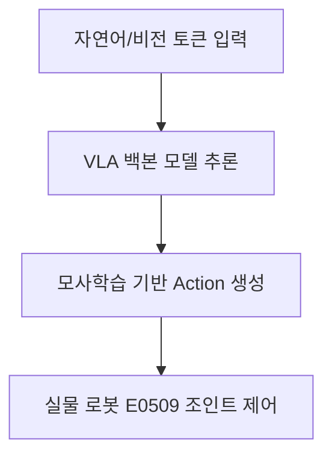

*Diagram Image Prompt*:
`Minimalist futuristic dashboard showcasing text prompt input box mapping to neural networks outputting complex robotic arm trajectories, dark navy background with cyan glowing nodes.`

---

## Slide 2: Phase 5 핵심 목표 (Phase 5 Objectives)
### 정적 제어 정책의 극복과 고유 확장성 확보
- **정적 FSM 한계 극복**: 환경 규격이 변경될 때마다 하드코딩 코드를 수정하는 방식에서 탈피하여, 자연어 명령어로 동적 가변 조작 유도
- **모사 학습 연동**: 전문가의 조작 시연(Demonstration) 데이터를 학습하여 인간 수준의 부드러운 장기 거동(Long-Horizon) 조작성 획득
- **다중 모델 배포**: BC, ACT, Diffusion Policy 모델 군을 구축하여 작업 복잡도와 연산 시간 요구사항에 부합하는 하이브리드 정책 적용

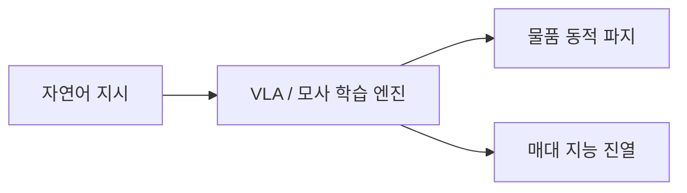

*Diagram Image Prompt*:
`Robotics system block showing interaction between human speech bubble, neural network, and multi-joint arm execution, flat vector design.`

---

## Slide 3: VLA(Vision-Language-Action) 개념 설계 (VLA Concept)
### 이미지와 언어를 로봇 동작으로 매핑하는 통합 트랜스포머 아키텍처
- **입력 토큰 결합**:
  1. **Visual Token**: Intel RealSense 카메라가 획득한 실시간 현장 이미지 프레임
  2. **Language Token**: 사용자의 가변 명령어 (예: *"하단 바스켓에서 음료수를 꺼내서 매대 중간 칸에 진열해줘"*)
- **출력 액션**: 다음 타겟 제어 스텝의 로봇 관절 위치 궤적 데이터 및 그리퍼 압착 상태 지시어 발행

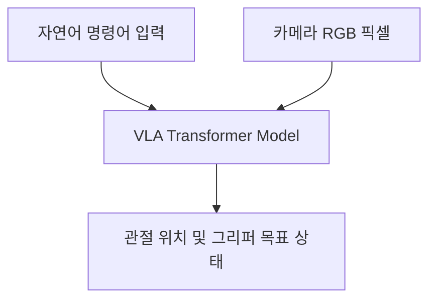

*Diagram Image Prompt*:
`Neural network flowchart merging text string tokens and image frame tensors into a single multi-modal transformer block, corporate technology slide style.`

---

## Slide 4: 모사 학습 프레임워크 (Imitation Learning Pipeline)
### 전문가 시연 데이터를 활용한 고정밀 조작 성능 획득
- **데이터 기반 제어**: 강화학습의 막대한 탐색(Exploration) 비용과 수렴 난이도를 보완하기 위해 성공 시연 궤적을 복제 학습
- **지원 정책 모델 군**:
  - **BC (Behavioral Cloning)**: 가장 기본적인 1:1 매핑 지도학습 정책
  - **ACT (Action Chunking with Transformers)**: 다점 제어 궤적을 묶어 시차 복잡도를 극복하는 트랜스포머 정책
  - **Diffusion Policy**: 노이즈 제거(Denoising) 확산 프로세스를 활용하여 다중 분달 행동 분포를 예측하는 최첨단 모델

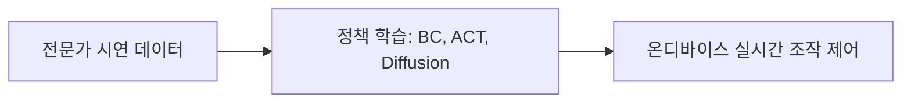

*Diagram Image Prompt*:
`Data processing pipeline: joystick controller demo recording -> storage drive database -> GPU training servers -> robot action, simple flat graphics.`

---

## Slide 5: LeRobot 데이터셋 빌더 (Dataset Builder)
### Hugging Face LeRobot 규격 기반 데이터 수집
- **수집 모듈**: [doosan_lerobot_dataset_builder.py](file:///home/iyangim/smart-shelf-robot/src/custom/rl/doosan_lerobot_dataset_builder.py)
- **실시간 구독 및 정합**:
  - 로봇의 관절 상태 `/dsr01/joint_states` 및 전압/토크 데이터 실시간 수집
  - Eye-to-Hand/Eye-in-Hand 카메라 이미지 `/camera/color/image_raw` 프레임 매칭
- **저장 규격**: 학습에 즉각 주입 가능한 Parquet 데이터셋 및 MP4 동기화 비디오 파일 자동 저장

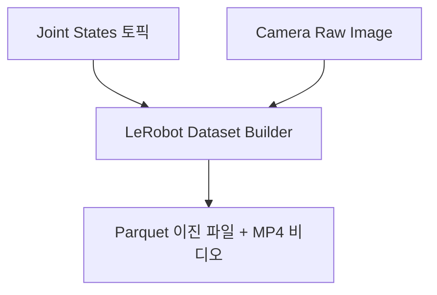

*Diagram Image Prompt*:
`Data logger server UI interface saving camera feed and graph plots into tidy dataset folders on a hard drive, clean flat layout.`

---

## Slide 6: 데이터 포맷 변환 유틸리티 (Data Conversion)
### 분산 분할 훈련을 위한 데이터 구조 변환 도구
- **동종 학습 모델 호환 파이프라인**:
  - [convert_to_zarr.py](file:///home/iyangim/smart-shelf-robot/src/rl/imitation_learning/convert_to_zarr.py): 수집한 이진 로깅 데이터를 고속 메모리 맵핑 및 대용량 데이터 로드가 용이한 Zarr 포맷으로 변환
  - [convert_zarr_to_hdf5.py](file:///home/iyangim/smart-shelf-robot/src/rl/imitation_learning/convert_zarr_to_hdf5.py): Diffusion Policy 오리지널 프레임워크 훈련용 표준 HDF5 데이터 세트로 최종 재압축 수행

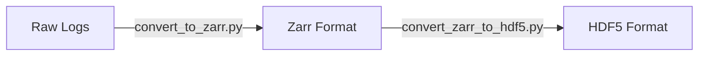

*Diagram Image Prompt*:
`File converter symbol mapping Zarr database boxes to HDF5 database cylinders, technology styling vector illustration.`

---

## Slide 7: Docker 기반 모사 학습 환경 (Docker Container)
### 외부 종속 라이브러리와의 충돌을 차단하기 위한 가상화 구축
- **환경 독립 파일**:
  - [Dockerfile](file:///home/iyangim/smart-shelf-robot/src/rl/imitation_learning/Dockerfile) (CUDA 가속 PyTorch 이미지 기반)
  - [docker-compose.yaml](file:///home/iyangim/smart-shelf-robot/src/rl/imitation_learning/docker-compose.yaml) (GPU 자원 할당 및 로컬 저장소 볼륨 매핑)
- **장점**: ROS 2 Humble 호스트 파이썬 환경 패키지 버전 간섭 없이 모방학습용 특화 PyTorch 및 Pybind 라이브러리 구동 보장

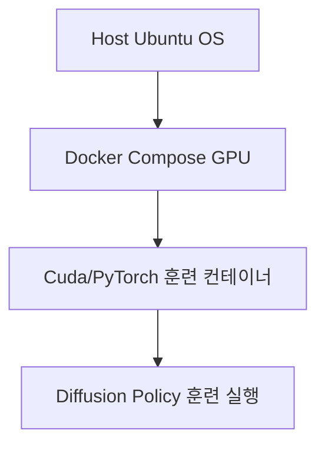

*Diagram Image Prompt*:
`Docker container box embedded on top of GPU motherboard graphics, with a green network line connecting to a folder, tech presentation.`

---

## Slide 8: Behavioral Cloning (BC) 정책 학습 (BC Policy)
### 가장 직관적인 지도학습 기반의 모사 제어
- **훈련 스크립트**: [train_bc.py](file:///home/iyangim/smart-shelf-robot/src/rl/imitation_learning/train_bc.py)
- **작동 원리**:
  - 특정 관측 이미지와 관절 위치값 쌍이 주어지면, 정답인 전문가 관절 속도/위치 타깃을 직접 회귀 분석(Regression) 예측
  - 단순 도달 및 단일 파지 태스크와 같이 분기나 다중 모달(Multi-modal) 분포 선택이 적은 단순 작업에 빠르고 안정적으로 수렴

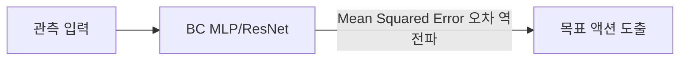

*Diagram Image Prompt*:
`Input observation graph linked directly to output joint vector grid via basic CNN block diagram, flat styling.`

---

## Slide 9: ACT (Action Chunking with Transformers) (ACT Policy)
### 장기 거동(Long-Horizon) 조작 안정화를 위한 트랜스포머 모델
- **훈련 스크립트**: [train_act.py](file:///home/iyangim/smart-shelf-robot/src/rl/imitation_learning/train_act.py)
- **핵심 기술**:
  - **Action Chunking**: 단일 순간의 조작 명령이 아니라, 미래의 연속된 N스텝 제어 궤적(Chunk)을 한 번에 예측하여 실행
  - **CVAE (Conditional Variational Autoencoder)**: 전문가 시연 데이터의 다양성과 미세 속도 프로파일을 잠재 공간(Latent Space)으로 추상화하여 예측 안정도 개선

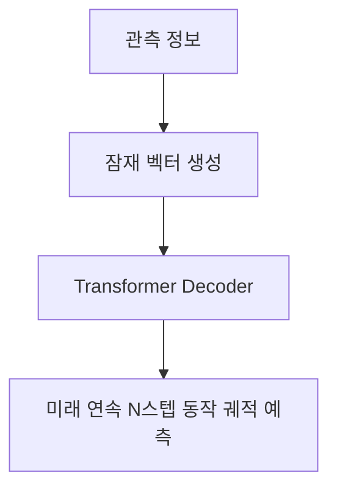

*Diagram Image Prompt*:
`A sequence of robotic arm ghost shadows showing upcoming trajectory path generated from a single decision point, visual action chunking concept.`

---

## Slide 10: Diffusion Policy 정책 학습 (Diffusion Policy)
### 확산 확률 모델을 활용한 복잡한 다중 모달 거동의 학습
- **훈련 스크립트**: [train_diffusion.py](file:///home/iyangim/smart-shelf-robot/src/rl/imitation_learning/train_diffusion.py)
- **작동 원리**:
  - 제어 목표 경로에 점진적으로 추가된 가우시안 노이즈를 역으로 제거(Denoising)해 나가며 최적 궤적 탐색
- **의의**: 로봇 조작 중 장애물을 왼쪽으로 돌아서 갈지 오른쪽으로 돌아서 갈지와 같은 **다중 선택 분기점(Multi-modal distribution)**에서 평균값 필터로 인해 부딪히는 기존 정책의 "평균화 실패"를 완벽히 차단

```mermaid
graph LR
    Noise[무작위 노이즈 궤적] -- Denoising Step -- Denoising Step --> Path[부드러운 최적 회피 궤적]
```

*Diagram Image Prompt*:
`Trajectory curve denoising visualization: scattered noisy dots converging step by step into a clean continuous motion path curve, vector style.`

---

## Slide 11: 자연어-비전 입력 결합 설계 (Multi-modal Input)
### 실시간 카메라 데이터와 언어 임베딩의 통합
- **텍스트 지시어 처리**:
  - DistilBERT 또는 CLIP Text Encoder 기반 자연어 지시 토큰 임베딩 생성
- **비전 센서 임베딩**:
  - ResNet 또는 ViT(Vision Transformer) 백본 네트워크를 이용해 실시간 컬러 이미지의 특징 공간 특징점 압축
- **결합층**: 임베딩된 텍스트와 비전 토큰을 Concatenate 또는 Cross-Attention 메커니즘을 통해 다중 모달 정보 레이어로 통합

*Diagram Image Prompt*:
`Infographic showing: Text box + Image window pointing to Feature Extractor blocks, merging into an Attention Matrix representation, vector art.`

---

## Slide 12: 실시간 행동 예측 루프 (Action Prediction Loop)
### 온디바이스 VLA 정책 실행을 위한 실시간 피드백 루프
- **주기적 추론 수행**:
  - ROS 2 비전 노드가 발행하는 이미지 토큰을 주기적으로 입력받아 모방학습 추론 수행 (10Hz ~ 20Hz 타깃)
- **궤적 오버랩 및 블렌딩**:
  - ACT나 Diffusion Policy가 출력한 미래 N스텝 궤적(Chunk)과 새로운 타임스텝의 예측 궤적을 가중치 평균(Temporal Ensembling) 기법으로 스무스하게 연결하여 끊김 없는 로봇 조작 제어 완성

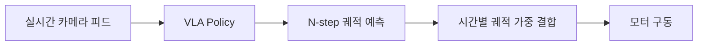

*Diagram Image Prompt*:
`Overlapping trajectory waves merging together smoothly into a single target line directing a robot gripper, clean visual illustration.`

---

## Slide 13: 미세 오차 및 외란 보정 (Robustness & Denoising)
### 디퓨전 프로세스 기반의 외란 강건성
- **동적 적응성**: 
  - 로봇 동작 중 외부에서 물건을 건드리거나, 매대 바스켓이 미세하게 틀어져 미끄러지는 상황 발생 시 실시간 이미지 관측값이 노이즈 제거 과정에 주입
- **실시간 복원력**:
  - 확산 역과정(Denoising)의 각 단계에서 바뀐 이미지 픽셀 정보가 반영되어, 궤적이 초기 지정 경로에 구속되지 않고 **상황 변화에 동적으로 재조정**

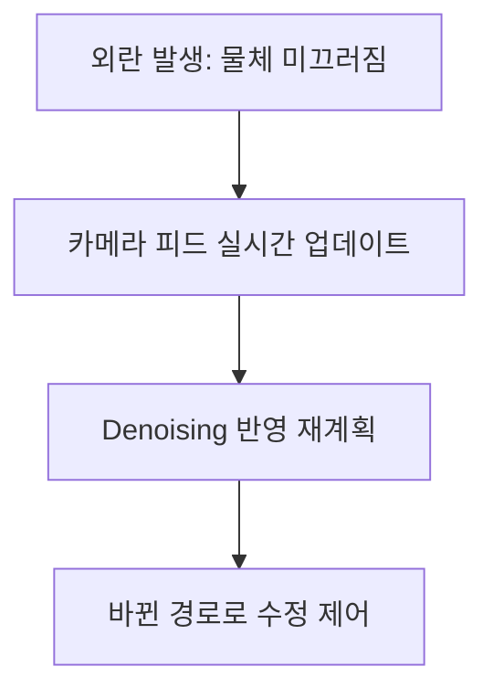

*Diagram Image Prompt*:
`Robotic hand reaching for a block, with a dynamic red line correcting path as block is shifted slightly to the side, vector art.`

---

## Slide 14: Sim-to-Real 모사 학습 전파 (Sim2Real Porting)
### 가상 모사 학습 정책의 두산 E0509 하드웨어 이식 방안
- **추론 구조**: 훈련 컨테이너 내에서 `.pt` 가중치를 온디바이스 실행기로 로드
- **데이터 얼라인먼트**:
  - 실하드웨어 2.5D 카메라의 포인트 필터링을 거친 이미지 픽셀 매핑
  - ROS 2 `/policy/joint_targets`로 계산된 절대 관절 타깃을 실시간 전송
- **안전 장치**: 급격한 궤적 이탈이나 임피던스 임계 초과 시 추론 스레드를 즉시 차단하는 긴급 가드 가동

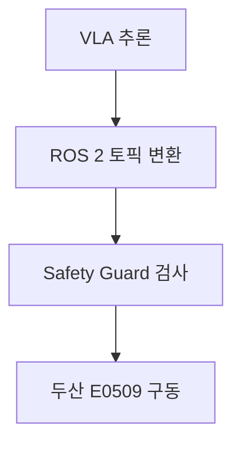

*Diagram Image Prompt*:
`A server rack sending digital code data lines to a physical yellow industrial robot arm, symbolizing hardware deployment.`

---

## Slide 15: 설치 및 실행 방법 가이드 (Installation & Run)
### 훈련용 Docker 구축 및 학습 커맨드라인
- **Docker 기반 훈련 컨테이너 빌드 및 백그라운드 기동**:
  ```bash
  cd src/rl/imitation_learning
  docker compose up -d
  ```
- **Diffusion Policy 정책 훈련 실행 명령**:
  ```bash
  # 훈련 컨테이너 내부 쉘 접속 후 train 실행
  docker compose exec imitation-learning-env python3 train_diffusion.py --config-name=doosan_pick_shelf
  ```
- **Zarr 파일 데이터 검사**:
  ```bash
  python3 convert_to_zarr.py --input_dir=data/raw_logs --output=data/dataset.zarr
  ```

*Diagram Image Prompt*:
`Standard command line terminal displaying docker compose commands, clean layout, minimalist UI.`

---

## Slide 16: 개발 시 오류 대처 방안 (Troubleshooting)
### 패키지 버전 호환성 해결을 위한 가이드라인
- **문제 1: PyTorch 버전 불일치로 인한 GPU 미인식**:
  - 호스트 머신의 CUDA 드라이버와 컨테이너 내 `torch` 라이브러리 간 cuXX 빌드 정합 필수
  - [Dockerfile](file:///home/iyangim/smart-shelf-robot/src/rl/imitation_learning/Dockerfile) 빌드 시 CUDA 12.8 버전에 일치하는 pytorch 전용 기본 도커 이미지 `pytorch/pytorch:2.2.0-cuda12.1-cudnn8-devel` 등 지정
- **문제 2: 비디오 생성 라이브러리 (moviepy/ffmpeg) 누락**:
  - 훈련 결과 로깅 영상 내보내기 시 `ffmpeg` 바인딩 경로 문제로 크래시가 발생하는 것을 대비해 가상 컨테이너 환경 내 `apt-get install ffmpeg` 사전 인가

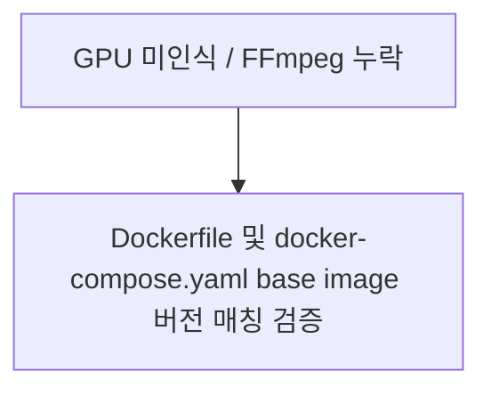

*Diagram Image Prompt*:
`Troubleshooting manual: magnifying glass examining dependency text lines with red error badges turning green, flat design.`

---

## Slide 17: 성능 및 유연성 비교 분석 (Evaluation & Comparison)
### 강화학습 단독 제어 대비 VLA/모사 학습의 가치
- **유연성 (Flexibility)**:
  - **강화학습 (RL)**: 정밀한 단일 행동에는 우수하나, 매대 슬롯 구성이 조금만 바뀌어도 재학습 필수
  - **VLA / 모사 학습**: 자연어 및 대형 비전 백본으로 새로운 물건이나 배치 변화에도 일반화(Generalization) 성능이 압도적으로 우수
- **학습 수렴 난이도**: 모사 학습은 전문가 데이터를 활용한 지도학습 형태이므로 학습 수렴 실패 확률이 대폭 낮음

| 제어 성능 항목 | 강화학습 단독 (PPO) | 모사 학습 + VLA 통합 |
| :--- | :--- | :--- |
| **자연어 지시 제어** | 불가 (FSM 설계 필요) | **가능 (End-to-End)** |
| **공간 변화 적응력** | 취약 (환경 재훈련) | **강력 (일반화 성능 확보)** |
| **학습 데이터 획득 시간** | 매우 길고 탐색 비용 큼 | **짧음 (전문가 데이터 중심)** |

*Diagram Image Prompt*:
`Two robotic hands facing each other holding comparing graphs: RL (PPO) vs Imitation (VLA), clean business dashboard style.`

---

## Slide 18: 결론 및 프로젝트 최종 마일스톤 (Conclusion)
### 스마트 매대 로봇 AI 전체 개발 로드맵 성공적인 완료
- **Phase 1~4 성과**: 가상 시뮬레이터 구축, 두산 로봇 6축 제어 포팅, hand-eye 캘리브레이션 정합 및 ROS 2 하드웨어 연동 인프라 구축 완수
- **Phase 5 성과**: 전문가 시연 데이터를 활용하는 모사 학습 훈련 모듈(BC, ACT, Diffusion Policy)과 Docker 가상화 구축 완료로 차세대 스마트 매대 지능화 정리 로직 확보
- **최종 가치**: 지능형 자연어 명령으로 움직이는 자동화 진열 매대 정비 로봇의 완성도 높은 설계 인프라 확립


*Diagram Image Prompt*:
`Golden medal showing robot emblem inside, robotic arm holding the medal high on a dark abstract background with glowing blue sparks.`
