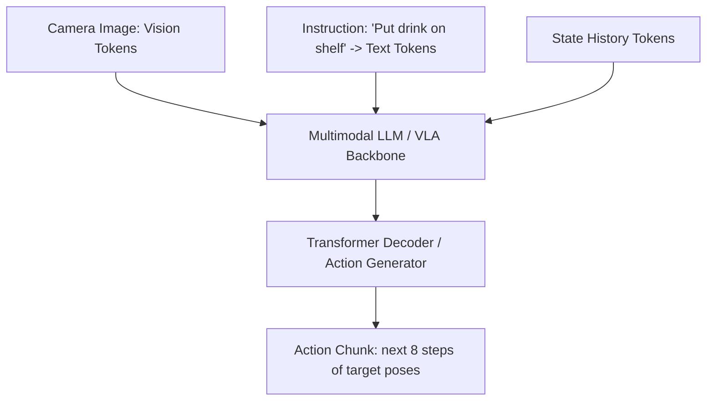
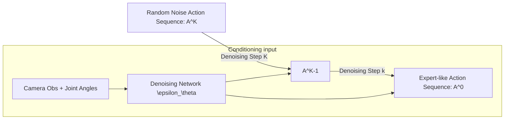

# Phase 5 Theory: VLA Models & Diffusion Policies

This document outlines the theoretical frameworks for Vision-Language-Action (VLA) models, Behavioral Cloning (BC), Action Chunking with Transformers (ACT), and Diffusion Policies used in long-horizon robot manipulation.

---

## 1. Imitation Learning: Behavioral Cloning (BC)

Imitation learning trains a policy $\pi_\theta(a \mid o)$ to mimic expert behavior from a dataset $\mathcal{D} = \{(o_i, a_i)\}_{i=1}^N$ containing observations $o$ and corresponding actions $a$.

### 1.1 Loss Function
Under a deterministic continuous control formulation, the mean squared error (MSE) loss is minimized:

$$\mathcal{L}_{BC}(\theta) = \mathbb{E}_{(o, a) \sim \mathcal{D}} \left[ \| \pi_\theta(o) - a \|_2^2 \right]$$

---

## 2. Diffusion Policy: Denoising Diffusion Probabilistic Models (DDPM)

Diffusion Policies model the action distribution as a conditional denoising process. Instead of predicting a single action, the policy generates a sequence of actions (action chunk) $A = [a_t, a_{t+1}, \dots, a_{t+T_a}]$ conditioned on observation history $O$.

### 2.1 Forward Process (Noise Addition)
The forward process adds Gaussian noise to the expert action sequence $A^0$ over $K$ steps:

$$q(A^k \mid A^{k-1}) = \mathcal{N}\left(A^k; \sqrt{1 - \beta_k} A^{k-1}, \beta_k I\right)$$
$$q(A^k \mid A^0) = \mathcal{N}\left(A^k; \sqrt{\bar{\alpha}_k} A^0, (1 - \bar{\alpha}_k) I\right)$$

Where $\alpha_k = 1 - \beta_k$ and $\bar{\alpha}_k = \prod_{i=1}^k \alpha_i$ define the noise schedule.

### 2.2 Reverse Process (Denoising)
The policy is parameterized as a network $\epsilon_\theta(A^k, k, O)$ that predicts the noise added at step $k$. The reconstructed action sequence is obtained via:

$$p_\theta(A^{k-1} \mid A^k, O) = \mathcal{N}\left(A^{k-1}; \mu_\theta(A^k, k, O), \Sigma_k\right)$$

$$\mu_\theta(A^k, k, O) = \frac{1}{\sqrt{\alpha_k}} \left( A^k - \frac{\beta_k}{\sqrt{1 - \bar{\alpha}_k}} \epsilon_\theta(A^k, k, O) \right)$$

---

## 3. Structural Diagrams

### 3.1 VLA (Vision-Language-Action) Sequence Processing


### 3.2 Diffusion Policy Denoising Pipeline


---

## 4. Plotting Script: Diffusion Denoising Visualizer

Below is a Python script to visualize the progressive denoising of an action trajectory from random Gaussian noise to a smooth, curved path.

```python
import numpy as np
import matplotlib.pyplot as plt

def diffusion_denoising_plot():
    steps = [0, 5, 20, 50] # Selection of diffusion steps
    n_points = 100
    x = np.linspace(0, 1.0, n_points)
    
    # Ground truth trajectory
    y_gt = np.sin(x * np.pi) * 0.5 + 0.2 * np.sin(3 * x * np.pi)
    
    plt.figure(figsize=(12, 8))
    
    # Generate denoising process
    np.random.seed(42)
    for idx, k in enumerate(steps):
        # Noise level decreases as step index k decreases
        noise_level = (k / 50.0)
        noise = np.random.normal(0, 0.15, n_points) * noise_level
        y_k = y_gt * (1.0 - noise_level) + noise
        
        alpha = 0.3 if k != 0 else 1.0
        linewidth = 1.5 if k != 0 else 3.0
        label = f'Step {k} (Noise level: {noise_level:.2f})' if k != 0 else 'Step 0 (Final Target Trajectory)'
        color = plt.cm.plasma(1.0 - noise_level)
        
        plt.plot(x, y_k, label=label, alpha=alpha, linewidth=linewidth, color=color)
        if k != 0:
            plt.scatter(x[::5], y_k[::5], color=color, alpha=0.3, s=15)
            
    plt.title("Action Trajectory Denoising Process (Diffusion Policy)")
    plt.xlabel("Trajectory Step / Normalized Time")
    plt.ylabel("Action Output Dimension (e.g. Flange X Pos)")
    plt.legend()
    plt.grid(True, alpha=0.3)
    plt.savefig("diffusion_trajectory_denoising.png")
    plt.show()

if __name__ == "__main__":
    diffusion_denoising_plot()
```

*Image Generation Prompt for Graph*:
`Scientific visualization of a diffusion policy denoising process showing lines progressing from highly noisy paths to a smooth, clean trajectory curve, warm color transitions, high quality presentation slide graphic.`
